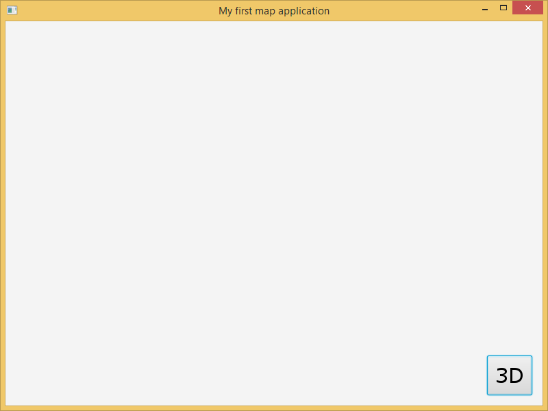
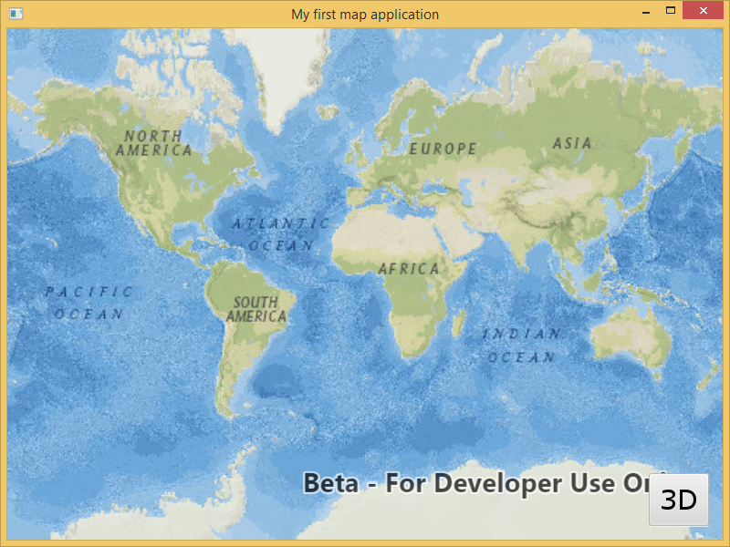

# Exercise 1: Map and Scene (Java)

This exercise walks you through the following:
- Create a new JavaFX app
- Add ArcGIS Runtime to the app
- Add a 2D map to the app
- Add a 3D scene to the app and a toggle button to switch between 2D and 3D

Prerequisites:
- Install the Java Development Kit (JDK) version 8 or higher.
- Optional: install a Java integrated development environment (IDE).

If you need some help, you can refer to [the solution to this exercise](../../solutions/Java/Ex1_MapAndScene), available in this repository.

## Create a new JavaFX app
1. Create a new Java application project in the IDE of your choice. (Note: if you use an IDE that supports Gradle and create a Gradle project, you will be able to use Gradle when it's time to add ArcGIS Runtime to the project.) Create a class that extends `javafx.application.Application`:

    ```
    package workshopapp;

    import javafx.application.Application;

    public class WorkshopApp extends Application {

    }
    ```

1. Instantiate a field of type `AnchorPane` that will hold the app's UI components:

    ```
    private final AnchorPane anchorPane = new AnchorPane();
    ```

1. Create a Java package called `resources` in your application. Go to [the images directory](../../images) of this repository and copy all of the images to your `resources` package. Then instantiate a `Button` and two `ImageView` fields that reference the images you copied. Use the 3D `ImageView` for the Button. Be sure to import `javafx.scene.image.Image`, rather than some other `Image` class. (Note: you can use text buttons without the images if you prefer.)

    ```
    private final ImageView imageView_2d =
          new ImageView(new Image(WorkshopApp.class.getResourceAsStream("/resources/two-d.png")));
    private final ImageView imageView_3d =
          new ImageView(new Image(WorkshopApp.class.getResourceAsStream("/resources/three-d.png")));
    private final Button button_toggle2d3d = new Button(null, imageView_3d);
    ```

1. Add a default constructor to your class:

    ```
    public WorkshopApp() {
        super();
    }
    ```
    
1. Implement the `start(Stage)` method. In `start(Stage)`, add the `Button` near the lower-right corner of the `AnchorPane`. Create a new JavaFX `Scene` with your `AnchorPane`. Set the `Stage`'s title, width, height, and scene, and then call `show` on the `Stage`:

    ```
    @Override
    public void start(Stage primaryStage) {
        AnchorPane.setRightAnchor(button_toggle2d3d, 15.0);
        AnchorPane.setBottomAnchor(button_toggle2d3d, 15.0);
        anchorPane.getChildren().addAll(button_toggle2d3d);

        Scene javaFxScene = new Scene(anchorPane);
        primaryStage.setTitle("My first map application");
        primaryStage.setWidth(800);
        primaryStage.setHeight(600);
        primaryStage.setScene(javaFxScene);
        primaryStage.show();
    }
    ```
    
1. Add a `main` method to your class that calls `Application.launch`:

    ```
    public static void main(String[] args) {
        launch(args);
    }
    ```
    
1. Compile and run your app. Verify that a button appears in the lower-right corner of the app:

    
    
## Add ArcGIS Runtime to the app

You have two options for adding ArcGIS Runtime Quartz to your Java application project. Choose one of the following:

1. **Use Gradle**: you can use Gradle if you started the exercise by creating a Gradle project. open `build.gradle` and add ArcGIS dependencies. See [Develop your first map app using Gradle](https://developers.arcgis.com/java/beta/guide/develop-your-first-mapping-app-using-gradle.htm) for details.

    ```
    group 'demoApp'
    version '1.0' 
    apply plugin: 'java'
    apply plugin: 'application'
    apply plugin: 'com.esri.arcgisruntime.java'
    buildscript {
        repositories {
            maven {
                url 'https://esri.bintray.com/arcgis'
            }
        }
        dependencies {
            classpath 'com.esri.arcgisruntime:gradle-arcgis-java-plugin:0.9.0'
        }
    }
    run {
        mainClassName = "demoApp.MyMapApp"
    }
    ```
    
2. **Use the downloaded ArcGIS Runtime SDK**: download the ArcGIS Runtime SDK (Quartz) for Java and unzip it. In your Java project, reference the JAR files in the SDK's `libs` directory. You must also copy the SDK's `jniLibs` and `resources` directories to your Java project directory. (There are other ways of referencing ArcGIS Runtime, but copying `jniLibs` and `resources` is the simplest.) See [Develop your first map app using the downloaded SDK](https://developers.arcgis.com/java/beta/guide/develop-your-first-map-app.htm) for details.

## Add a 2D map to the app

1. Before your constructor, instantiate a `MapView` field, and declare an `ArcGISMap` field:

    ```
    private final MapView mapView = new MapView();
    private ArcGISMap map;
    ```
    
1. In your constructor, instantiate the `ArcGISMap`, set its basemap, and set the `MapView`'s map:

    ```
    map = new ArcGISMap();
    map.setBasemap(Basemap.createNationalGeographic());
    mapView.setMap(map);
    ```
    
1. Fill the `AnchorPane` with the `MapView`. Edit the `addAll` call to add the `MapView` before adding the `Button`:

    ```
    AnchorPane.setLeftAnchor(mapView, 0.0);
    AnchorPane.setRightAnchor(mapView, 0.0);
    AnchorPane.setTopAnchor(mapView, 0.0);
    AnchorPane.setBottomAnchor(mapView, 0.0);
    // Edit the addAll call you added previously
    anchorPane.getChildren().addAll(mapView, button_toggle2d3d);
    ```
    
1. Implement the `stop()` method. Inside that method, call `dispose()` on the MapView:

    ```
    @Override
    public void stop() throws Exception {
        mapView.dispose();
        
        super.stop();
    }
    ```
    
1. Compile and run your app. Verify that a map fills the window and that a button appears in the lower-right corner of the app on top of the map:

    