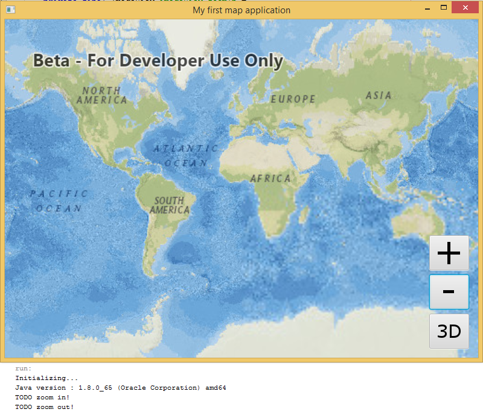

# Exercise 2: Add Zoom In and Zoom Out Buttons (Java)

This exercise walks you through the following:
- Add zoom in and zoom out buttons to the UI
- Zoom in and out on the map and the scene

Prerequisites:
- Complete [Exercise 1], or get the Exercise 1 code solution compiling and running properly, preferably in an IDE.

If you need some help, you can refer to [the solution to this exercise](../../solutions/Java/Ex2_ZoomButtons), available in this repository.

## Add zoom in and zoom out buttons to the UI
1. If desired, make a copy of your Exercise 1 class. Just make sure you're running your Exercise 2 code as you complete this exercise.
1. In your class, before your constructor, instantiate two buttons: one for zooming in, and one for zooming out:

    ```
    private final ImageView imageView_zoomIn =
            new ImageView(new Image(WorkshopApp.class.getResourceAsStream("/resources/zoom-in.png")));
    private final ImageView imageView_zoomOut =
            new ImageView(new Image(WorkshopApp.class.getResourceAsStream("/resources/zoom-out.png")));
    private final Button button_zoomIn = new Button(null, imageView_zoomIn);
    private final Button button_zoomOut = new Button(null, imageView_zoomOut);
    ```
    
1. In your `start(Stage)` method, after adding the MapView and 2D/3D toggle button to the UI, add the zoom in and zoom out buttons to the UI, near the 2D/3D toggle button in the lower right corner:

    ```
    AnchorPane.setRightAnchor(button_zoomOut, 15.0);
    AnchorPane.setBottomAnchor(button_zoomOut, 80.0);
    AnchorPane.setRightAnchor(button_zoomIn, 15.0);
    AnchorPane.setBottomAnchor(button_zoomIn, 145.0);
    anchorPane.getChildren().addAll(button_zoomOut, button_zoomIn);
    ```
    
1. Create `private void` event handler methods for the zoom in and zoom out buttons. Add a `System.out.println` to each event handler for now, just to verify that the buttons work:

    ```
    private void button_zoomIn_onAction() {
        System.out.println("TODO zoom in!");
    }
    
    private void button_zoomOut_onAction() {
        System.out.println("TODO zoom out!");
    }
    ```
    
1. In your constructor, set the zoom buttons' `onAction` handlers to call the event handler methods you just created:

    ```
    button_zoomIn.setOnAction(event -> button_zoomIn_onAction());
    button_zoomOut.setOnAction(event -> button_zoomOut_onAction());
    ```
    
1. Compile and run your app. Verify that the zoom buttons display on top of the map, that they do not block the 2D/3D toggle button, and that the event handler methods are called when you click them:

    

## Zoom in and out on the map and the scene
    
## How did it go?

If you have trouble, **refer to the solution code**, which is linked near the beginning of this exercise. You can also **submit an issue** in this repo to ask a question or report a problem. If you are participating live with Esri presenters, feel free to **ask a question** of the presenters.

If you completed the exercise, congratulations! You learned how to add buttons that programmatically zoom in and out on a 2D map and a 3D scene.

Ready for more? Choose from the following:

- [**Exercise 3: Add a Feature Layer**](Exercise 3 Local Feature Layer.md)
- **Bonus**: TODO