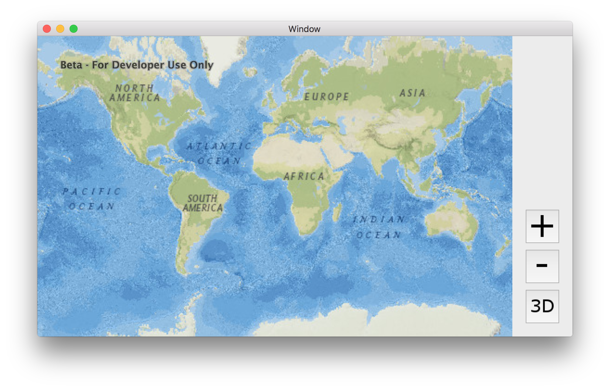

# Exercise 2: Add Zoom In and Zoom Out Buttons (Mac OS X/Swift)

This exercise walks you through the following:
- Add zoom in and zoom out buttons to the UI
- Zoom in and out on the map and the scene

Prerequisites:
- Complete [Exercise 1](Exercise 1 Map and Scene.md), or get the Exercise 1 code solution compiling and running properly in Xcode.

If you need some help, you can refer to [the solution to this exercise](../../../solutions/OS X/Swift/Ex2_ZoomButtons), available in this repository.

## Add zoom in and zoom out buttons to the UI

1. In `Main.storyboard`, add two **Image Buttons** above the 2D/3D toggle button. Make their size 50x50 and set appropriate constraints. Add a border to each. Choose `zoom_in` for one button’s image and `zoom_out` for the other.

1. Open `ViewController.swift` in the Assistant Editor. Create an Action connection (not an Outlet connection) from each new button to the ViewController class:

    ```
    @IBAction func button_zoomIn_onAction(sender: NSButton) {
    }
    
    @IBAction func button_zoomOut_onAction(sender: NSButton) {
    }
    ```
    
1. Compile and run your app. Verify that the zoom buttons display. If desired, use the Xcode debugger to verify that the action methods are called when you click the buttons.

    

## Zoom in and out on the map and the scene

1. In ArcGIS Runtime, zooming on a map and zooming on a scene use simple but quite different mechanisms. We'll talk more about those mechanisms later, but for now, get ready to zoom by creating an empty `private func zoomMap(factor: Double)` method and a `private func zoomScene(factor: Double)` method in your class.

1. Rather than having your action methods call `zoomMap` and `zoomScene` directly, you can simplify your code by creating a generic `zoom(factor: Double)` method that calls `zoomMap` or `zoomScene` depending on whether you're currently in 2D mode or 3D mode:

    ```
    private func zoom(factor: Double) {
        if (threeD) {
            zoomScene(factor);
        } else {
            zoomMap(factor);
        }
    }
    ```
    
1. In your zoom button action methods, add a call to `zoom(double)` with a _factor_. Use a factor between 0 and 1 to zoom out, and use a factor greater than 1 to zoom in:

    ```
    @IBAction func button_zoomIn_onAction(sender: NSButton) {
        zoom(2.0);
    }
    
    @IBAction func button_zoomOut_onAction(sender: NSButton) {
        zoom(0.5);
    }
    ```
    
1. For the ArcGIS Runtime 2D map view, the zoom mechanism is relatively simple: get the map scale, divide it by a factor, and use the quotient to set the map view’s viewpoint scale. Write the code for this operation inside the `zoomMap(Double)` method. You don’t need to run any code when the zoom completes, so you can pass `nil` as the `completion` parameter.

    ```
    mapView.setViewpointScale(mapView.mapScale / factor,
                              completion: nil);
    ```
    
1. 3D is awesome, but it is almost always more complicated than 2D, and zooming is no exception. ArcGIS Runtime's 3D scene view uses a _viewpoint_ with a _camera_ to change the user's view of the scene. Objects of type `Camera` are immutable and have a fluent API, so you can get a copy of the scene view’s current viewpoint camera, use a factor to move it toward or away from the camera's current target, and use it as the scene view’s new viewpoint camera. You can even animate the camera's movement and specify the duration of the animated camera movement (the code that follows uses `0.5` to animate for half a second). In this case, we will use the `Camera`'s `zoomTowardTargetPoint` method to create a new `Camera`. Add the following code to your `zoomScene(Double)` method:

    ```
    let target = sceneView.currentViewpointWithType(AGSViewpointType.CenterAndScale)?.targetGeometry as! AGSPoint
    let camera = sceneView.currentViewpointCamera().zoomTowardTargetPoint(target, factor: factor)
    sceneView.setViewpointCamera(camera, duration: 0.5, completion: nil)
    }
    ```
    
1. Compile and run your app. Verify that the zoom in and out buttons work in both 2D mode and 3D mode.
    
## How did it go?

If you have trouble, **refer to the solution code**, which is linked near the beginning of this exercise. You can also **submit an issue** in this repo to ask a question or report a problem. If you are participating live with Esri presenters, feel free to **ask a question** of the presenters.

If you completed the exercise, congratulations! You learned how to add buttons that programmatically zoom in and out on a 2D map and a 3D scene.

Ready for more? Start on [**Exercise 3: Add a Feature Layer**](Exercise 3 Local Feature Layer.md).
