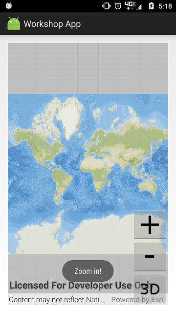

# Exercise 2: Add Zoom In and Zoom Out Buttons (Android)

This exercise walks you through the following:
- Add zoom in and zoom out buttons to the UI
- Zoom in and out on the map

Prerequisites:
- Complete [Exercise 1](Exercise%201%20Map.md), or get the Exercise 1 code solution compiling and running properly, preferably in an IDE.

If you need some help, you can refer to [the solution to this exercise](../../solutions/Android/Ex2_ZoomButtons), available in this repository.

## Add zoom in and zoom out buttons to the UI

1. In `res/layout/activity_main.xml`, add to the `RelativeLayout` two buttons: one for zooming in, and one for zooming out, and place them above the 2D/3D toggle button (note: `zoom_out` and `zoom_in` refer to images that you copied in the previous exercise):

    ```
    <ImageButton
        android:id="@+id/imageButton_zoomOut"
        android:layout_width="wrap_content"
        android:layout_height="wrap_content"
        android:layout_alignParentRight="true"
        android:layout_above="@id/imageButton_toggle2d3d"
        android:src="@drawable/zoom_out"
        android:onClick="imageButton_zoomOut_onClick"/>
    <ImageButton
        android:id="@+id/imageButton_zoomIn"
        android:layout_width="wrap_content"
        android:layout_height="wrap_content"
        android:layout_alignRight="@id/imageButton_zoomOut"
        android:layout_above="@id/imageButton_zoomOut"
        android:src="@drawable/zoom_in"
        android:onClick="imageButton_zoomIn_onClick"/>
    ```
    
1. The XML you just added specifies an `onClick` method for each button. Create a `public void` method with a `View` parameter for each of those method names. For now, you can put a `Toast` in each method just to see that they run:

    ```
    public void imageButton_zoomIn_onClick(View view) {
        Toast.makeText(this, "Zoom in!", Toast.LENGTH_SHORT).show();
    }

    public void imageButton_zoomOut_onClick(View view) {
        Toast.makeText(this, "Zoom out!", Toast.LENGTH_SHORT).show();
    }
    ```
    
1. Run your app. Verify that the zoom buttons display on top of the map and that the event handler methods are called when you click them:

    

## Zoom in and out on the map and the scene

1. In ArcGIS Runtime, zooming on a map and zooming on a scene use simple but quite different mechanisms. We'll talk more about those mechanisms later, but for now, get ready to zoom by creating an empty `private void zoomMap(double)` method and an empty `private void zoomScene(double)` method in your class. For each of these methods, it's a good idea to name the parameter `factor`.

1. Rather than having your event handlers call `zoomMap` and `zoomScene` directly, you can simplify your code by creating a generic `zoom(double)` method that calls `zoomMap` or `zoomScene` depending on whether you're currently in 2D mode or 3D mode:

    ```
    private void zoom(double factor) {
        if (threeD) {
            zoomScene(factor);
        } else {
            zoomMap(factor);
        }
    }
    ```
    
1. In your zoom button event handler methods, replace the `Toast`s with a call to `zoom(double)` with a _factor_. Use a factor between 0 and 1 to zoom out, and use a factor greater than 1 to zoom in:

    ```
    private void imageButton_zoomIn_onAction() {
        zoom(2.0);
    }
    
    private void imageButton_zoomOut_onAction() {
        zoom(0.5);
    }
    ```

1. For the ArcGIS Runtime 2D `MapView`, the zoom mechanism is relatively simple: get the map scale, divide it by a factor, and use the quotient to set the `MapView`'s viewpoint scale. Write the code for this operation inside the `zoomMap(double)` method:

    ```
    mapView.setViewpointScaleAsync(mapView.getMapScale() / factor);
    ```
    
1. 3D is awesome, but it is almost always more complicated than 2D, and zooming is no exception. ArcGIS Runtime's 3D `SceneView` uses a _viewpoint_ with a _camera_ to change the user's view of the scene. Objects of type `Camera` are immutable and have a fluent API, so you can get a copy of the `SceneView`'s current viewpoint camera, use a factor to move it toward or away from the camera's current target, and use it as the `SceneView`'s new viewpoint camera. You can even animate the camera's movement and specify the duration of the animated camera movement (the code that follows uses `0.5f` to animate for half a second). In this case, we will use the `Camera`'s `zoomToward` method to create a new `Camera`. Add the following code to your `zoomScene(double)` method. As you do, make sure you import `com.esri.arcgisruntime.geometry.Point` and `com.esri.arcgisruntime.mapping.view.Camera` instead of some other `Point` and `Camera` classes:

    ```
    Geometry target = sceneView.getCurrentViewpoint(Viewpoint.Type.CENTER_AND_SCALE).getTargetGeometry();
    if (target instanceof Point) {
        Camera camera = sceneView.getCurrentViewpointCamera()
                .zoomToward((Point) target, factor);
        sceneView.setViewpointCameraAsync(camera, 0.5f);
    } else {
        // This shouldn't happen, but in case it does...
        Logger.getLogger(MainActivity.class.getName()).log(Level.WARNING,
                "SceneView.getCurrentViewpoint returned {0} instead of {1}",
                new String[] { target.getClass().getName(), Point.class.getName() });
    }
    ```
    
1. Run your app. Verify that the zoom in and out buttons work.
    
## How did it go?

If you have trouble, **refer to the solution code**, which is linked near the beginning of this exercise. You can also **submit an issue** in this repo to ask a question or report a problem. If you are participating live with Esri presenters, feel free to **ask a question** of the presenters.

If you completed the exercise, congratulations! You learned how to add buttons that programmatically zoom in and out on a 2D map and a 3D scene.

Ready for more? Start on [**Exercise 3: Add a Feature Layer**](Exercise%203%20Local%20Feature%20Layer.md).
