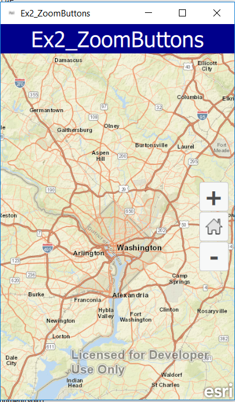

# Exercise 2: Add Zoom In, Zoom Out, and Location Buttons (AppStudio)

This exercise walks you through the following:
- Add zoom in, zoom out, and location buttons to the UI
- Zoom in and out on the map and the scene

Prerequisites:
- Complete [Exercise 1](Exercise 1 Map.md), or get the Exercise 1 code solution compiling and running properly, preferably in AppStudio.

If you need some help, you can refer to [the solution to this exercise](../../solutions/AppStudio/Ex2_ZoomButtons), available in this repository.

## Add zoom in, zoom out, and location buttons to the UI
1. If desired, make a copy of your Exercise 1 or continue to use the Exercise 1 solution. Just make sure you're running your Exercise 2 code as you complete this exercise.

1. First we need to import the import ArcGIS.AppFramework.Controls 1.0.

    ```
    import ArcGIS.AppFramework.Controls 1.0
    ```
 
1. Next we need to add the buttons to the app.  
    ```
       Column{
            anchors.right: parent.right
            anchors.top: titleRect.bottom
            spacing: 10
            padding: 5
            Button {
                id:zoomIn
                visible: true
                height: 32
                width: 32
                text: "+"
                enabled: true
                style: ButtonStyle {
                    background: Rectangle {
                        implicitWidth: 100
                        implicitHeight: 25
                        border.width: control.activeFocus ? 2 : 1
                        border.color: "#888"
                        radius: 4
                        gradient: Gradient {
                            GradientStop { position: 0 ; color: control.pressed ? "#ccc" : "#eee" }
                            GradientStop { position: 1 ; color: control.pressed ? "#aaa" : "#ccc" }
                        }
                    }
                }
                onClicked: {
                    var theScale = mapView.mapScale
                    theScale = theScale - (theScale/2)
                    mapView.setViewpointScale(theScale)
                }

            }
            Button {
                id:zoomOut
                visible: true
                height: 32
                width: 32
                text: "-"
                enabled: true
                style: ButtonStyle {
                    background: Rectangle {
                        implicitWidth: 100
                        implicitHeight: 25
                        border.width: control.activeFocus ? 2 : 1
                        border.color: "#888"
                        radius: 4
                        gradient: Gradient {
                            GradientStop { position: 0 ; color: control.pressed ? "#ccc" : "#eee" }
                            GradientStop { position: 1 ; color: control.pressed ? "#aaa" : "#ccc" }
                        }
                    }
                }
                onClicked: {
                    var theScale = mapView.mapScale
                    theScale += theScale
                    mapView.setViewpointScale(theScale)
                }
            }
        }

    ```
    
1. Compile and run your app. Verify that the zoom buttons display on top of the map:

    


## How did it go?

If you have trouble, **refer to the solution code**, which is linked near the beginning of this exercise. You can also **submit an issue** in this repo to ask a question or report a problem. If you are participating live with Esri presenters, feel free to **ask a question** of the presenters.

If you completed the exercise, congratulations! You learned how to add buttons that  zoom in and out on a 2D map as well as add the button for location.

Ready for more? Start on [**Exercise 3: Add a Feature Layer**](Exercise 3 Feature Service.md).
