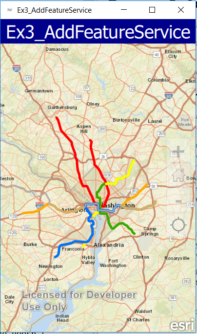

# Exercise 3: Add a Add Feature Service (AppStudio)

This exercise walks you through the following:
- Add the metro lines from a feature service to the map

Prerequisites:
- Complete [Exercise 2](Exercise 2 Zoom Buttons.md), or get the Exercise 2 code solution compiling and running properly, preferably in AppStudio.

If you need some help, you can refer to [the solution to this exercise](../../solutions/AppStudio/Ex3_AddFeatureService), available in this repository.

## Add a layer from a feature service to the map

ArcGIS Runtime provides a variety of ways to add **operational layers** to the map--feature services, dynamic map services, offline geodatabases, and mobile map packages, for example. In this exercise, you will add a feature service.

1. To add a feature service you will need to create a FeatureLayer:

    ```
        FeatureLayer {
               ServiceFeatureTable {
                   url: "http://services.arcgis.com/lA2FZKuu26Fips7U/arcgis/rest/services/MetroLines/FeatureServer/0"
               }
           }
    ```  
1. Compile and run your app. Verify that the map zooms to Washington, D.C., and that a layer of metro lines appears on top of the basemap. 

    


## How did it go?

If you have trouble, **refer to the solution code**, which is linked near the beginning of this exercise. You can also **submit an issue** in this repo to ask a question or report a problem. If you are participating live with Esri presenters, feel free to **ask a question** of the presenters.

If you completed the exercise, congratulations! You learned how to add a scene service to the 3D map.
   ```
    ArcGISSceneLayer{
                    url: "https://tiles.arcgis.com/tiles/gdD5QuS3M8xgrMER/arcgis/rest/services/BuildingsDC/SceneServer"
                }
    ```  


Ready for more? Choose from the following:

- [**Exercise 4: Buffer a Point and Query Features**](Exercise 4 Buffer and Query.md)
