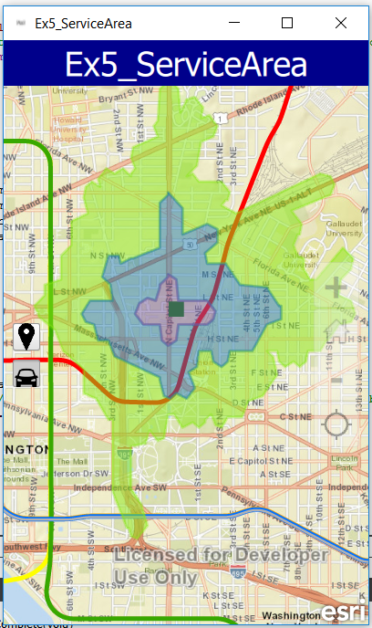

# Exercise 5: Service Area (AppStudio)

This exercise walks you through the following:
- Get the user to click on the map and calculate drive times from that location
- Display them on the map

Prerequisites:
- Complete [Exercise 4](Exercise 4 Buffer and Query.md), or get the Exercise 4 code solution compiling and running properly, preferably in AppStudio.

If you need some help, you can refer to [the solution to this exercise](../../solutions/AppStudio/Ex5_ServiceArea), available in this repository.

## Create drive times from users click on the map

After doing Exercise 4, this should seem familiar to you.

1. First we should create a new button for the drive time.  We want this button to appear under the buffer and query button so put it within the context of the Column under the other button:

    ```
    Button {
                id: drivetimeButton
                enabled: true
                Image {
                    anchors.fill: parent
                    source: "https://raw.githubusercontent.com/garys-esri/geodev-dc-labs/master/2016-11-runtime/images/car.png"
                    //source: "http://static.arcgis.com/images/Symbols/SafetyHealth/Hospital.png"
                    fillMode: Image.PreserveAspectFit
                }
                checkable: true
                width: 30
                height: 30
                checked: false

                onPressedChanged: {
                    
                }
            }

    ```
1. We need to add a bit of code into the onPressedChanged for each button (DriveTime and BufferAndQuery).  If one button is already pressed and the other is pressed we want to set the checked to false for the one that was already pressed and clear any graphics from the previous mouse clicks on the map.  The drivetimeButton onPressedChanged will look like:
    ```
    onPressedChanged: {
                    if (!checked){
                        if (bufferqueryButton.checked)
                            bufferqueryButton.checked = false;
                        startGraphics.graphics.clear();
                        metrostopsLayer.clearSelection();
                    }
                }
    ```
    And the bufferandquery button onPressedChanged will look like this:
	```
    onPressedChanged: {
                    if (!checked){
                        if (drivetimeButton.checked)
                            drivetimeButton.checked = false;
                        startGraphics.removeAllGraphics();
                        metrostopsLayer.clearSelection();
                    }
                }
    ```
1. Add a global variable for facilities parameters:
	```
    	property var facilityParams: null
	```

1. Also create some graphics and symbols for these features:

    ```
      SimpleFillSymbol {
            id: polygonFill
            // default property: ouline
                    SimpleLineSymbol {
                        style: Enums.SimpleLineSymbolStyleDash
                        color: Qt.rgba(0.0, 0.0, 0.5, 1)
                        width: 1
                        antiAlias: true
                    }
        }

        Graphic {
            id: serviceAreaPolygonGraphic
        }

        SimpleLineSymbol {
            id: symbolOutline
            color: "black"
            width: 0.5
        }

        SimpleMarkerSymbol {
            id: facilitySymbol
            color: "blue"
            style: Enums.SimpleMarkerSymbolStyleSquare
            size: 10
            outline: symbolOutline
        }

        Graphic {
            id: facilityGraphic
            symbol: facilitySymbol
        }
        
    ```

1. Next we will need to create the DefaultParameters that will be passed to the serviceAreaTask that we will create later:  

    ```
    function setupRouting() {
            //busy = true;
            //message = "";
            serviceAreaTask.createDefaultParameters();
        }
    ```    
    
1. Now let's add the code for when the button for drivetime is clicked and the user clicks on the map.  This will be added as an else if to the onMouseClicked.  Basically we are getting the graphic where the user clicked and adding this location to the facilitiesFeatures that we created earlier and then creating the taskParameters properties for the facility locations, defaultBreaks, and the outSpatialReference.

    ```
    else if (drivetimeButton.checked) {
                   if (startGraphics.graphics.count === 0) {
                     startGraphics.graphics.append(graphic);
                     var facilitiesFeatures = [];
                     var facilities = ArcGISRuntimeEnvironment.createObject(
                                   "ServiceAreaFacility", {geometry: graphic.geometry});
                     //console.log(facilities);

                     facilitiesFeatures.push(facilities);
                     console.log(facilitiesFeatures.length);


                     console.log(facilityParams);
                     facilityParams.setFacilities(facilitiesFeatures);

                     console.log("call solver");
                     serviceAreaTask.solveServiceArea(facilityParams);
                   }
               }
    ```

1. Since the ServiceArea requires a credentials to use the service, we can do this a couple different ways but this exercise we will use the clientId and clientSecret.  You get these by going to developers.arcgis.com and registering your app with the org account that you are using for the class.  Once you have these add the strings below with this code:

    ```
     Credential {
            id: oAuthCredentials
            oAuthClientInfo: OAuthClientInfo {
                clientId: "2MGu4pheoHoITxjH"
                clientSecret: "361f3be9e7884af8aefcf893e0de0e9d"
                oAuthMode: Enums.OAuthModeApp

            }
        }
    ```
    
1. Now let's build the solver for the service area.  In the serviceAreaTask we will pass the url for the rest service and in the onSolveStatusChanged if it is complete we will add the polygons to the map by randomly assigning different colored polygons for the service areas.  

    ```
   ServiceAreaTask {
            id: serviceAreaTask
            url: "http://route.arcgis.com/arcgis/rest/services/World/ServiceAreas/NAServer/ServiceArea_World"
            //url: "http://sampleserver6.arcgisonline.com/arcgis/rest/services/NetworkAnalysis/SanDiego/NAServer/ServiceArea"
            credential: oAuthCredentials

            onLoadStatusChanged: {
                if (loadStatus !== Enums.LoadStatusLoaded)
                    return;

                setupRouting();
            }
            onSolveServiceAreaStatusChanged: {

                if (solveServiceAreaStatus === Enums.TaskStatusCompleted) {

                    var results = solveServiceAreaResult.resultPolygons(0);
                    var theVal = results.length - 1;
                    for (var index = theVal; index >= 0; index--) {
                        var polySymbol = ArcGISRuntimeEnvironment.createObject("SimpleFillSymbol");
                        polySymbol.color = Qt.rgba(Math.random()%255, Math.random()%255, Math.random()%255, .5);
                        var resultGeometry = results[index].geometry;

                        var graphic = ArcGISRuntimeEnvironment.createObject("Graphic", {geometry: resultGeometry, symbol: polySymbol});
                        startGraphics.graphics.append(graphic);
                    }
                } else if (solveServiceAreaResult === null || solveServiceAreaResult.error) {
                    errorMsg = "Solve error:" + solveServiceAreaResult.error.message + "\nPlease reset and start over.";
                    messageDialog.visible = true;
                }
            }
            onCreateDefaultParametersStatusChanged: {
                console.log("inside oncreatedefaultparams changed");
                       if (createDefaultParametersStatus !== Enums.TaskStatusCompleted)
                           return;

                       busy = false;
                       facilityParams = createDefaultParametersResult;
                       facilityParams.defaultImpedanceCutoffs = [1.0, 3.0, 5.0];
                       facilityParams.outputSpatialReference = SpatialReference.createWebMercator();
                       facilityParams.returnPolygonBarriers = true;
                       facilityParams.polygonDetail = Enums.ServiceAreaPolygonDetailHigh;
                       console.log("facilityparams:  ", facilityParams.defaultImpedanceCutoffs);
                   }

        }
   ```
    

1. Compile and run your app. Verify that you can click the drive time button and click on the map and drive times are created.:

    

    
## How did it go?

If you have trouble, **refer to the solution code**, which is linked near the beginning of this exercise. You can also **submit an issue** in this repo to ask a question or report a problem. If you are participating live with Esri presenters, feel free to **ask a question** of the presenters.

If you completed the exercise, congratulations! You learned how to calculate a service area using a web service and display the service areas on the map.


That concludes the exercises for this workshop. Well done!
