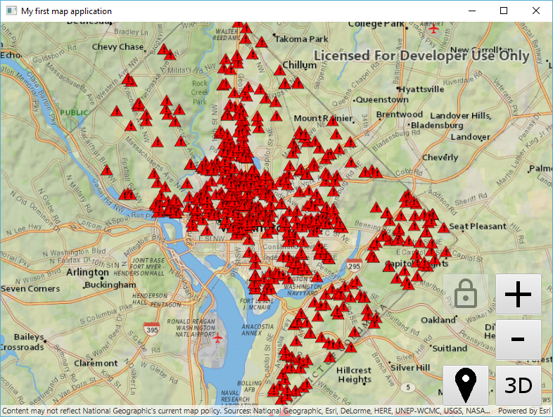
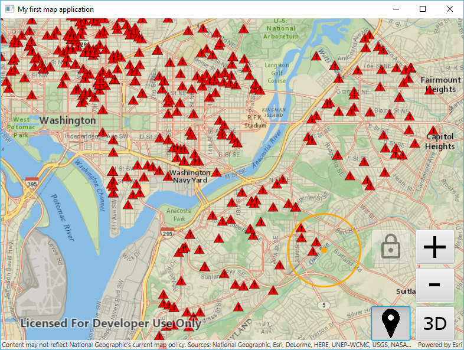
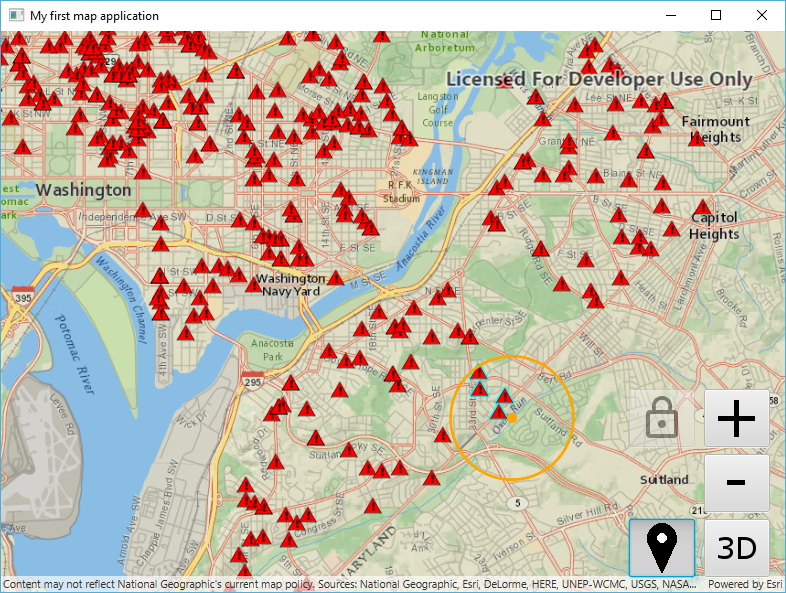

# Exercise 4: Buffer a Point and Query Features (Java)

This exercise walks you through the following:
- Get the user to click a point
- Display the clicked point and a buffer around it
- Query for features within the buffer

Prerequisites:
- Complete [Exercise 3](Exercise%203%20Operational%20Layers.md), or get the Exercise 3 code solution compiling and running properly, preferably in an IDE.

If you need some help, you can refer to [the solution to this exercise](../../solutions/Java/Ex4_BufferAndQuery), available in this repository.

## Get the user to click a point

You can use ArcGIS Runtime to detect when and where the user interacts with the map or scene, either with the mouse or with a touchscreen. In this exercise, you just need the user to click or tap a point. You could detect every user click, but instead, we will let the user activate and deactivate this capability with a toggle button.

1. Before your constructor, instantiate a `ToggleButton` using [one of the images you downloaded](../../images/location.png) during [Exercise 1](Exercise 1 Map and Scene.md):

    ```
    private final ImageView imageView_location =
            new ImageView(new Image(WorkshopApp.class.getResourceAsStream("/resources/location.png")));
    private final ToggleButton toggleButton_bufferAndQuery = new ToggleButton(null, imageView_location);
    ```
    
1. In your `start(Stage)` method, place the new `ToggleButton` in the UI:

    ```
    AnchorPane.setRightAnchor(toggleButton_bufferAndQuery, 90.0);
    AnchorPane.setBottomAnchor(toggleButton_bufferAndQuery, 15.0);
    anchorPane.getChildren().add(toggleButton_bufferAndQuery);
    ```

1. Create a `private void` method to serve as an event handler for the toggle button you added:

    ```
    private void toggleButton_bufferAndQuery_onAction() {
    
    }
    ```

1. In your constructor, set the toggle button's `onAction` event to call your event handler method:

    ```
    toggleButton_bufferAndQuery.setOnAction(event -> toggleButton_bufferAndQuery_onAction());
    ```
    
1. Create a `private void bufferAndQuery(MouseEvent)` method for calculating a buffer and performing a query based on the user's click on the map or scene. You will write most of the code for this method later, but for now, just detect whether or not the user clicked with the primary mouse button and do a `println` if he or she did. (Be sure to import `javafx.scene.input.MouseEvent` instead of some other `MouseEvent` class.)

    ```
    private void bufferAndQuery(MouseEvent event) {
        if (MouseButton.PRIMARY.equals(event.getButton()) && event.isStillSincePress()) {
            System.out.println("Clicked on map or scene!");
        } else {
            return;
        }
    }
    ```
    
1. Go back to your event handler method for the buffer and query toggle button (we called it `toggleButton_bufferAndQuery_onAction`). This method runs when the user toggles the button on or off. If the button is toggled on, we need to tell the `MapView` and `SceneView` to call `bufferAndQuery(MouseEvent)` when the user clicks the map or scene. If the button is toggled off, we need to tell the `MapView` and `SceneView` to do nothing in particular when the user clicks the map or scene. Check whether the `SceneView` is `null` when setting the event handler. Add this code to your event handler method:

    ```
    if (toggleButton_bufferAndQuery.isSelected()) {
        mapView.setOnMouseClicked(mouseEvent -> bufferAndQuery(mouseEvent));
        if (null != sceneView) {
            sceneView.setOnMouseClicked(mouseEvent -> bufferAndQuery(mouseEvent));
        }
    } else {
        mapView.setOnMouseClicked(null);
        if (null != sceneView) {
            sceneView.setOnMouseClicked(null);
        }
    }
    ```
    
1. In `button_toggle2d3d_onAction()`, after instantiating the `SceneView`, if `toggleButton_bufferAndQuery` is already selected, set the `SceneView`'s `onMouseClicked` event to call `bufferAndQuery(MouseEvent)`:

    ```
    if (toggleButton_bufferAndQuery.isSelected()) {
        sceneView.setOnMouseClicked(event -> bufferAndQuery(event));
    }
    ```
    
1. Compile and run your app. Verify that a new toggle button appears and that your `println` prints text when and only when the toggle button is toggled on and you click the map or the scene:

    
    
## Display the clicked point and a buffer around it

You need to buffer the clicked point and display both the point and the buffer as graphics on the map or scene.

1. Before the constructor, instantiate fields for the symbols for the clicked point and buffer. You can adjust the colors, styles, and widths if desired. In the following code, the point symbol is a 10-pixel circle with an orange (FFA500) color and no transparency (alpha = FF), and the buffer symbol is a hollow polygon with a 3-pixel orange (FFA500) solid line border with no transparency (alpha = FF):

    ```
    private static final SimpleMarkerSymbol CLICK_SYMBOL =
            new SimpleMarkerSymbol(SimpleMarkerSymbol.Style.CIRCLE, 0xFFffa500, 10);
    private static final SimpleFillSymbol BUFFER_SYMBOL =
            new SimpleFillSymbol(SimpleFillSymbol.Style.NULL, 0xFFFFFFFF,
                    new SimpleLineSymbol(SimpleLineSymbol.Style.SOLID, 0xFFFFA500, 3));
    ```
    
1. Before the constructor, instantiate two `GraphicsOverlay` fields: one for the map and one for the scene:

    ```
    private final GraphicsOverlay bufferAndQueryMapGraphics = new GraphicsOverlay();
    private final GraphicsOverlay bufferAndQuerySceneGraphics = new GraphicsOverlay();
    ```
    
1. In your constructor, add the map `GraphicsOverlay` to the `MapView`:

    ```
    mapView.getGraphicsOverlays().add(bufferAndQueryMapGraphics);
    ```
    
1. In `button_toggle2d3d_onAction()`, after the call to `scene.addDoneLoadingListener`, add the scene `GraphicsOverlay` to the `SceneView`. The one for the map only required one line of code, while this one for the scene requires an extra line of code to specify that the graphics should be draped on the 3D surface:

    ```
    bufferAndQuerySceneGraphics.getSceneProperties().setSurfacePlacement(SurfacePlacement.DRAPED);
    sceneView.getGraphicsOverlays().add(bufferAndQuerySceneGraphics);
    ```

1. Create a `private Point getGeoPoint(MouseEvent)` method to convert a `MouseEvent` to a `Point`. This method should use either the `MapView` or the `SceneView` to convert a screen point to a geographic point, depending on whether the app is currently in 2D mode or 3D mode. You're only going to call `getGeoPoint(MouseEvent)` in one place here in Exercise 4, so you don't really have to create a method just for this. But you will thank yourself for writing this method when you get to Exercise 5. (Be sure to import `javafx.geometry.Point2D` instead of some other `Point2D` class.)

    ```
    private Point getGeoPoint(MouseEvent event) {
        Point2D screenPoint = new Point2D(event.getX(), event.getY());
        Point geoPoint = threeD ?
                sceneView.screenToBaseSurface(screenPoint) :
                mapView.screenToLocation(screenPoint);
        return geoPoint;
    }
    ```

1. In `bufferAndQuery(MouseEvent)`, you need to replace your `println` with code to create a buffer and display the point and buffer as graphics. First, use `getGeoPoint(MouseEvent)` to convert the `MouseEvent` to a geographic point. Next, create a 1000-meter buffer, using `GeometryEngine.ellipseGeodesic(GeodesicEllipseParams)` as follows:

    ```
    Point geoPoint = getGeoPoint(event);
    // Buffer by 1000 meters
    GeodesicEllipseParameters params = new GeodesicEllipseParameters();
    params.setCenter(geoPoint);
    params.setGeometryType(GeometryType.POLYGON);
    params.setLinearUnit(new LinearUnit(LinearUnitId.METERS));
    params.setMaxPointCount(1000);
    params.setMaxSegmentLength(1.0);
    params.setSemiAxis1Length(1000.0);
    Polygon buffer = (Polygon) GeometryEngine.ellipseGeodesic(params);
    ```

1. In `bufferAndQuery(MouseEvent)`, add the point and buffer as graphics. You only need to add them to the `GraphicsOverlay` for the `GeoView` currently in use--`MapView` or `SceneView`--so check the value of `threeD` and choose a `GraphicsOverlay` accordingly. Clear its graphics and then add the point and buffer as new `Graphic` objects:

    ```
    ListenableList<Graphic> graphics = (threeD ? bufferAndQuerySceneGraphics : bufferAndQueryMapGraphics).getGraphics();
    graphics.clear();
    graphics.add(new Graphic(buffer, BUFFER_SYMBOL));
    graphics.add(new Graphic(geoPoint, CLICK_SYMBOL));
    ```

1. Compile and run your app. Verify that if you toggle the buffer and select button and then click the map or scene, the point you clicked and a 1000-meter buffer around it appear on the map or scene:

    

    
    
## Query for features within the buffer

There are a few different ways to query and/or select features in ArcGIS Runtime. Here we will use `FeatureLayer.selectFeaturesAsync(QueryParameters, FeatureLayer.SelectionMode)`, which both highlights selected features on the map or scene and provides a list of the selected features.

1. In `bufferAndQuery(MouseEvent)`, after creating the buffer and adding graphics, instantiate a `QueryParameters` object with the buffer geometry:

    ```
    QueryParameters query = new QueryParameters();
    query.setGeometry(buffer);
    ```
    
1. For each of the `FeatureLayer` objects in the operational layers of the `SceneView`'s scene or the `MapView`'s map, call `selectFeaturesAsync(QueryParameters, FeatureLayer.SelectionMode)`. Use `FeatureLayer.SelectionMode.NEW` to do a new selection, as opposed to adding to or removing from the current selection. Add this code after instantiating the query object and setting its geometry:

    ```
    LayerList operationalLayers = threeD ?
            sceneView.getArcGISScene().getOperationalLayers() :
            mapView.getMap().getOperationalLayers();
    operationalLayers.parallelStream().filter(
            layer -> layer instanceof FeatureLayer
    ).forEach(layer -> {
        ((FeatureLayer) layer).selectFeaturesAsync(query, FeatureLayer.SelectionMode.NEW);
    });
    ```
    
1. Compile and run your app. Verify that features within the clicked buffer are highlighted on the map or scene:

    
    
## How did it go?

If you have trouble, **refer to the solution code**, which is linked near the beginning of this exercise. You can also **submit an issue** in this repo to ask a question or report a problem. If you are participating live with Esri presenters, feel free to **ask a question** of the presenters.

If you completed the exercise, congratulations! You learned how to get a user's input on the map or scene, buffer a point, display graphics on the map or scene, and select features based on a query.

Ready for more? Choose from the following:

- [**Exercise 5: Routing**](Exercise%205%20Routing.md)
- **Bonus**
    - We selected features but didn't do anything with the selected features' attributes. The call to [`selectFeaturesAsync`](https://developers.arcgis.com/java/latest/api-reference//reference/com/esri/arcgisruntime/layers/FeatureLayer.html#selectFeaturesAsync(com.esri.arcgisruntime.data.QueryParameters, com.esri.arcgisruntime.layers.FeatureLayer.SelectionMode)) returns a Java `Future` with a `get()` method that returns a `FeatureQueryResult`, which lets you iterate through selected features. See if you can look at the feature attributes to get more information about the selected features.
    - Try setting properties on the `QueryParameters` object to change the query's behavior. For example, maybe you want to select all features that are _outside_ the buffer instead of those that are inside. How would you do that by adding just one line of code? What other interesting things can you do with `QueryParameters`?
