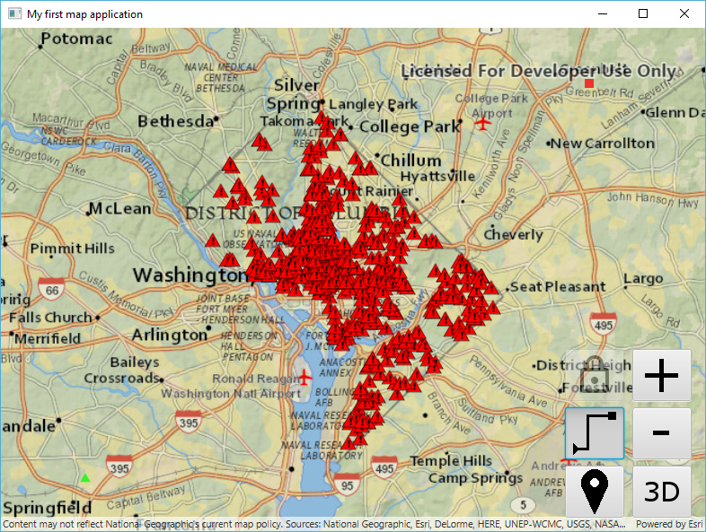
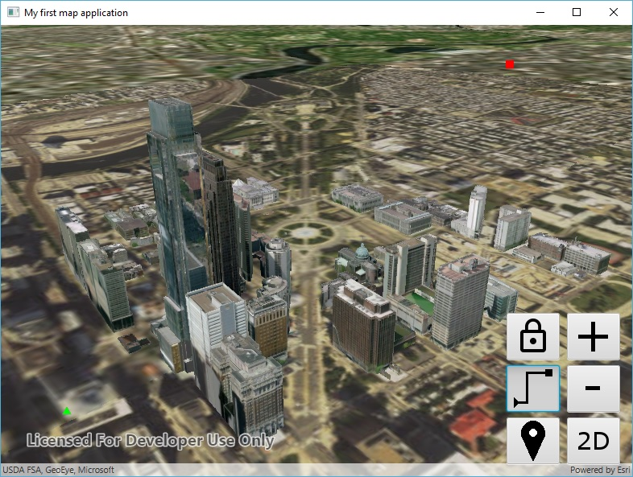

# Exercise 5: Routing (Java)

ArcGIS Runtime 100.0 features the ability to run ArcGIS geoprocessing for analysis and data management. The `GeoprocessingTask` class lets you call any geoprocessing service and many geoprocessing packages (.gpk). ArcGIS Runtime provides more specific support for certain types of geoprocessing, such as network routing using Network Analyst services or local network datasets. By learning how to use routing in this exercise, you will learn key skills that will help you use other geoprocessing capabilities that ArcGIS Runtime supports.

This exercise walks you through the following:
- Get the user to click an origin point and a destination point
- Calculate a driving route from the origin to the destination
- Display the route on the map or scene

Prerequisites:
- Complete [Exercise 4](Exercise 4 Buffer and Query.md), or get the Exercise 4 code solution compiling and running properly, preferably in an IDE.

If you need some help, you can refer to [the solution to this exercise](../../solutions/Java/Ex5_Routing), available in this repository.

## Get the user to click an origin point and a destination point

After doing Exercise 4, this should seem familiar to you.

1. Before your constructor, instantiate symbols for the origin point, destination point, and route line:

    ```
    private static final SimpleMarkerSymbol ROUTE_ORIGIN_SYMBOL =
            new SimpleMarkerSymbol(SimpleMarkerSymbol.Style.TRIANGLE, 0xC000FF00, 10);
    private static final SimpleMarkerSymbol ROUTE_DESTINATION_SYMBOL =
            new SimpleMarkerSymbol(SimpleMarkerSymbol.Style.SQUARE, 0xC0FF0000, 10);
    private static final SimpleLineSymbol ROUTE_LINE_SYMBOL =
            new SimpleLineSymbol(SimpleLineSymbol.Style.SOLID, 0xC0550055, 5);
    ```

1. Before your constructor, instantiate a toggle button to enable routing:

    ```
    private final ImageView imageView_routing =
            new ImageView(new Image(WorkshopApp.class.getResourceAsStream("/resources/routing.png")));
    private final ToggleButton toggleButton_routing = new ToggleButton(null, imageView_routing);
    ```
    
1. Before your constructor, instantiate two `GraphicsOverlay` objects for routing--one for the map and one for the scene--just as you did in a previous exercise. Also declare a non-`final` Point to store the origin point and set it to `null` for now:

    ```
    private final GraphicsOverlay mapRouteGraphics = new GraphicsOverlay();
    private final GraphicsOverlay sceneRouteGraphics = new GraphicsOverlay();
    private Point originPoint = null;
    ```

1. In your constructor, add the `GraphicsOverlay` objects to the `MapView`:

    ```
    mapView.getGraphicsOverlays().add(mapRouteGraphics);
    ```    
    
1. In `button_toggle2d3d_onAction()`, after the call to `scene.addDoneLoadingListener`, add the scene `GraphicsOverlay` to the `SceneView`:

    ```
    sceneRouteGraphics.getSceneProperties().setSurfacePlacement(SurfacePlacement.DRAPED);
    sceneView.getGraphicsOverlays().add(sceneRouteGraphics);
    ```

1. In your `start(Stage)` method, place the routing toggle button in the UI:

    ```
    AnchorPane.setRightAnchor(toggleButton_routing, 90.0);
    AnchorPane.setBottomAnchor(toggleButton_routing, 80.0);
    anchorPane.getChildren().add(toggleButton_routing);
    ```
    
1. In `button_toggle2d3d_onAction()`, near the start of the method, set `originPoint` to `null` so that we don't try to use an origin from the 2D map with a destination from the 3D scene or vice versa:

    ```
    originPoint = null;
    ```
    
1. In `toggleButton_bufferAndQuery_onAction()`, if the buffer and query toggle button is selected, un-select the routing toggle button. _Note: if we had more than two toggle buttons, we would want to do something smarter than this. Since this exercise is not about building a UI, we're naïvely assuming there will only ever be two toggle buttons._

    ```
    toggleButton_routing.setSelected(false);
    ```
    
1. Create a method to serve as an event handler for the routing toggle button:

    ```
    private void toggleButton_routing_onAction() {
    
    };
    ```
    
1. In your constructor, set the routing toggle button's onAction event to call the event handler method you just created:

    ```
    toggleButton_routing.setOnAction(event -> toggleButton_routing_onAction());
    ```
    
1. Create a `private void addStopToRoute(MouseEvent)` method that takes a mouse event, converts it to a geographic point, adds it to the map or scene as a graphic, and either saves it as an origin point or calculates the route if an origin point already exists. For now, we'll do everything but actually calculate the route. Start by declaring the method and checking to see if it's really a mouse click:

    ```
    private void addStopToRoute(MouseEvent event) {
        if (MouseButton.PRIMARY.equals(event.getButton()) && event.isStillSincePress()) {
        
        }
    }
    ```
    
1. In `addStopToRoute(MouseEvent)`, inside the `if` block, get the list of route graphics, depending on whether or not we are in 3D mode:

    ```
    ListenableList<Graphic> graphics = (threeD ? sceneRouteGraphics : mapRouteGraphics).getGraphics();
    ```
    
1. After getting the graphics list, call `getGeoPoint(MouseEvent)` to convert the `MouseEvent` to a geographic `Point`. Remove the point's z-value if present, since a z-value will cause the routing not to work:

    ```
    Point point = getGeoPoint(event);
    if (point.hasZ()) {
        point = new Point(point.getX(), point.getY(), point.getSpatialReference());
    }
    ```
    
1. Create an `if-else` statement that determines whether or not `originPoint` is `null`:

    ```
    if (null == originPoint) {
    
    } else {
    
    }
    ```
    
1. If `originPoint` is `null`, then this is the first route point the user has clicked. Save the point as `originPoint`, clear the graphics, and add `originPoint` as a graphic:

    ```
    originPoint = point;
    graphics.clear();
    graphics.add(new Graphic(originPoint, ROUTE_ORIGIN_SYMBOL));
    ```
    
1. If `originPoint` is not `null`, then this is the second route point the user has clicked. Add the point as a graphic, and then reset the routing by setting `originPoint` to `null`. It is in this block that you will write the code that calculates the route, but you will write that code later in this exercise. For now, just add the graphic and set `originPoint` to `null`:

    ```
    graphics.add(new Graphic(point, ROUTE_DESTINATION_SYMBOL));
    originPoint = null;
    ```
    
1. In `button_toggle2d3d_onAction()`, after instantiating the `SceneView`, if the route toggle button is already selected, set the buffer and query listener on the `SceneView`:

    ```
    if (toggleButton_routing.isSelected()) {
        sceneView.setOnMouseClicked(event -> addStopToRoute(event));
    }
    ```
    
1. Fill in the body of `toggleButton_routing_onAction()`. If the routing toggle button has been un-selected, set the `MapView` and `SceneView` `onMouseClicked` listeners to `null`. If the routing toggle button has been selected, set the `onMouseClicked` listeners to call `addStopToRoute` with the mouse event. Be sure to check for a null `sceneView`. Finally, whether routing has been activated or deactivated, set `originPoint` to null in order to reset the routing:

    ```
    if (toggleButton_routing.isSelected()) {
        mapView.setOnMouseClicked(mouseEvent -> addStopToRoute(mouseEvent));
        if (null != sceneView) {
            sceneView.setOnMouseClicked(mouseEvent -> addStopToRoute(mouseEvent));
        }
        toggleButton_bufferAndQuery.setSelected(false);
    } else {
        mapView.setOnMouseClicked(null);
        if (null != sceneView) {
            sceneView.setOnMouseClicked(null);
        }
    }
    ```

1. Compile and run your app. Verify that you can toggle on the routing button, click an origin point, click a destination point, and see both points displayed. Verify this behavior in both 2D and 3D:

    

    
    
## Display the route on the map or scene

1. Before your constructor, declare a `RouteTask` field and a `RouteParameters` field:

    ```
    private final RouteTask routeTask;
    private final RouteParameters routeParameters;
    ```
    
1. In your constructor, instantiate the `RouteTask`, set its ArcGIS Online username and password, and get the `RouteParameters` from the `RouteTask`. But instantiate them in such a way that if getting the `RouteParameters` fails, both the `RouteTask` and the `RouteParameters` are set to `null`, as a signal to the rest of the code that routing is not available. _Note: in this exercise, we're naïvely hard-coding our username and password. Don't do that! It is too easy for someone to decompile your code. There are at least three better options: use an OAuth 2.0 user login, use an OAuth 2.0 app login, or challenge the user for credentials. For now, since the exercise is about routing and not security, just hard-code the username and password._ Here is the code to add to your constructor:

    ```
    RouteTask theRouteTask = new RouteTask("http://route.arcgis.com/arcgis/rest/services/World/Route/NAServer/Route_World");        
    // Don't share this code without removing plain text username and password!!!
    theRouteTask.setCredential(new UserCredential("theUsername", "thePassword"));
    RouteParameters theRouteParameters = null;
    try {
        theRouteParameters = theRouteTask.createDefaultParametersAsync().get();
    } catch (InterruptedException | ExecutionException ex) {
        Logger.getLogger(WorkshopApp.class.getName()).log(Level.SEVERE, null, ex);
        theRouteTask = null;
    }
    routeTask = theRouteTask;
    routeParameters = theRouteParameters;
    ```
    
1. In your constructor, after setting `routeTask` and `routeParameters`, if getting the `RouteParameters` succeeded (i.e. if `routeParameters` is not `null`), set some of the parameters. We don't need route directions or stops (we already have the stops), but we do need routes. If the `RouteParameters` object is null, disable the routing toggle button because routing is not available:

    ```
    if (null != routeParameters) {
        routeParameters.setReturnDirections(false);
        routeParameters.setReturnRoutes(true);
        routeParameters.setReturnStops(false);
    } else {
        toggleButton_routing.setDisable(true);
    }
    ```
    
1. Write the rest of the code for the `addStopToRoute` method. In that method, you have an `else` block containing two lines of code: a line that adds a graphic, and a line that sets `originPoint` to `null`. Between those two lines, clear the route parameters' stops and add both `originPoint` and `point` to the route parameters` stops:

    ```
    routeParameters.getStops().clear();
    for (Point p : new Point[]{ originPoint, point }) {
        routeParameters.getStops().add(new Stop(p));
    }
    ```
    
1. After adding the stops, call `RouteTask.solveRouteAsync(RouteParameters)` to solve the route asynchronously. That call returns a `ListenableFuture`, on which you can add a done listener. In that listener, call `get()` on the `ListenableFuture`, and then call `getRoutes()`, get the first route, and add it as a graphic. The call to `get()` can throw two different types of exceptions, which you must catch (or catch all `Throwable` objects if you prefer):

    ```
    ListenableFuture<RouteResult> solveFuture = routeTask.solveRouteAsync(routeParameters);
    solveFuture.addDoneListener(() -> {
        try {
            RouteResult routeResult = solveFuture.get();
            if (0 < routeResult.getRoutes().size()) {
                graphics.add(new Graphic(routeResult.getRoutes().get(0).getRouteGeometry(), ROUTE_LINE_SYMBOL));
            }
        } catch (ExecutionException | InterruptedException e) {
            Logger.getLogger(WorkshopApp.class.getName()).log(Level.SEVERE, null, e);
        }
    });
    ```
    
1. Compile and run your app. Verify that you can calculate and display a route in both 2D and 3D:

    
    
    
    
## How did it go?

If you have trouble, **refer to the solution code**, which is linked near the beginning of this exercise. You can also **submit an issue** in this repo to ask a question or report a problem. If you are participating live with Esri presenters, feel free to **ask a question** of the presenters.

If you completed the exercise, congratulations! You learned how to calculate a driving route using a web service and display the route on the map.

Ready for more? Choose from the following bonus challenges:
- Instead of hard-coding your ArcGIS Online username and password, challenge the user for a username and password. This is more of a UI problem than an ArcGIS problem; just get the username and password in a dialog or something and pass them to the `UserCredential` constructor.
- In fact, you can do even better than creating your own username/password dialog. A wise user will feel nervous about typing his or her username and password into an arbitrary app. You can give the user some reassurance by implementing an OAuth 2.0 user login, in which ArcGIS Online (or ArcGIS Enterprise) generates a login page, which you display in a web control. That way, your program never directly handles the username and password, but you get back a short-lived token that you can use to authenticate to ArcGIS services. See if you can implement an OAuth 2.0 user login for the routing. Hint: take a look at [`OAuthTokenCredentialRequest`](https://developers.arcgis.com/java/latest/api-reference//reference/com/esri/arcgisruntime/security/OAuthTokenCredentialRequest.html); that documentation has suggested steps for performing the OAuth 2.0 login.
- Allow the user to add more than two points for the route.
- Allow the user to add barriers in addition to stops.
- Look at the properties you can set on [`RouteParameters`](https://developers.arcgis.com/java/latest/api-reference//reference/com/esri/arcgisruntime/tasks/networkanalysis/RouteParameters.html) and try a few of them to change the routing behavior.

That concludes the exercises for this workshop. Well done!