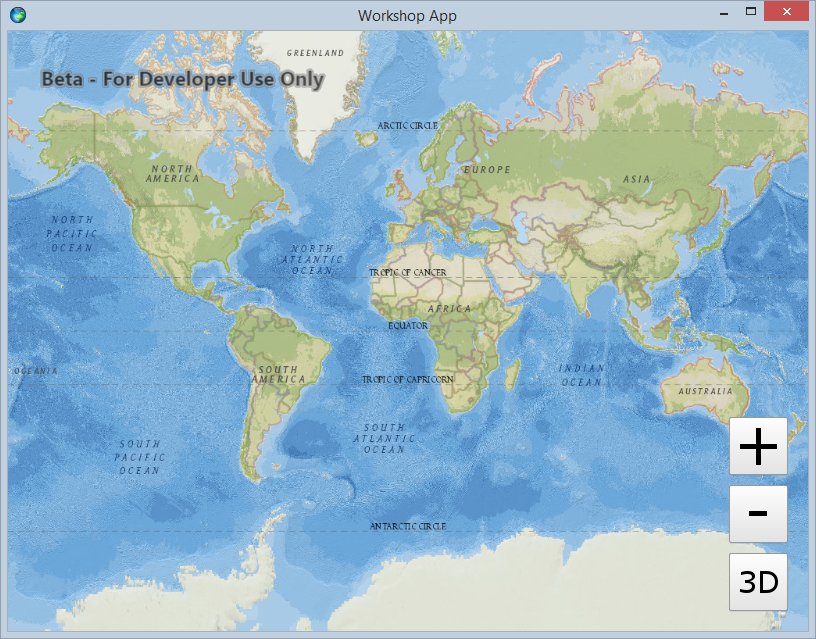

# Exercise 2: Add Zoom In and Zoom Out Buttons (Qt Quick)

This exercise walks you through the following:
- Add zoom in and zoom out buttons to the UI
- Zoom in and out on the map and the scene

Prerequisites:
- Complete [Exercise 1](Exercise%201%20Map%20and%20Scene.md), or get the Exercise 1 code solution compiling and running properly in Qt Creator.

If you need some help, you can refer to [the solution to this exercise](../../../solutions/Qt/Qt%20Quick/Ex2_ZoomButtons), available in this repository.

## Add zoom in and zoom out buttons to the UI

1. In your QML file, under `ApplicationWindow`, create a function called `zoom` that takes a parameter called `factor`. We will fill in this function later, but for now, just print to the console for debugging:

    ```
    function zoom(factor) {
        console.log("zoom factor: " + factor);
    }
    ```
    
1. After the 2D/3D toggle button, create zoom out and zoom in buttons that call your `zoom` function when clicked:

    ```
    Button {
        id: button_zoomOut
        iconSource: "qrc:///Resources/zoom_out.png"
        anchors.right: mapView.right
        anchors.rightMargin: 20
        anchors.bottom: button_toggle2d3d.top
        anchors.bottomMargin: 10

        onClicked: {
            zoom(0.5)
        }
    }
    
    Button {
        id: button_zoomIn
        iconSource: "qrc:///Resources/zoom_in.png"
        anchors.right: mapView.right
        anchors.rightMargin: 20
        anchors.bottom: button_zoomOut.top
        anchors.bottomMargin: 10

        onClicked: {
            zoom(2)
        }
    }
    ```
    
1. Run your app. Verify that the zoom buttons appear and that output is written to the log in Qt Creator when you click the new buttons:

    

## Zoom in and out on the map and the scene

1. Create a function for zooming the map and a function for zooming the scene:

    ```
    function zoomMap(factor) {
        mapView.setViewpointScale(mapView.mapScale / factor);
    }

    function zoomScene(factor) {
        var target = sceneView.currentViewpointCenter.center;
        var camera = sceneView.currentViewpointCamera.zoomToward(target, factor);
        sceneView.setViewpointCameraAndSeconds(camera, 0.5);
    }
    ```
    
1. In `zoom`, call either `zoomMap` or `zoomScene`, depending on whether we are in 2D mode or 3D mode:

    ```
    var zoomFunction = threeD ? zoomScene : zoomMap;
    zoomFunction(factor);
    ```
    
1. Run your app. Verify that the zoom in and zoom out buttons work on both the map and the scene.
    
## How did it go?

If you have trouble, **refer to the solution code**, which is linked near the beginning of this exercise. You can also **submit an issue** in this repo to ask a question or report a problem. If you are participating live with Esri presenters, feel free to **ask a question** of the presenters.

If you completed the exercise, congratulations! You learned how to add buttons that programmatically zoom in and out on a 2D map and a 3D scene.

Ready for more? Start on [**Exercise 3: Add a Feature Layer**](Exercise%203%20Local%20Feature%20Layer.md).