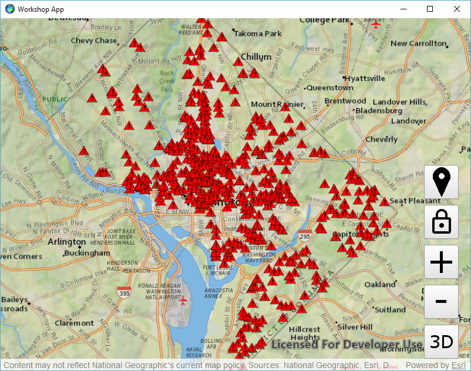
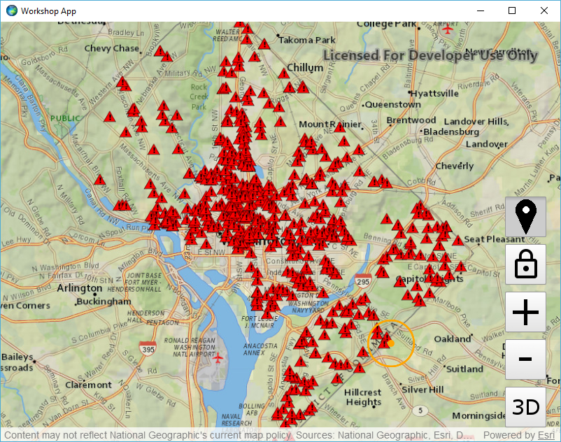
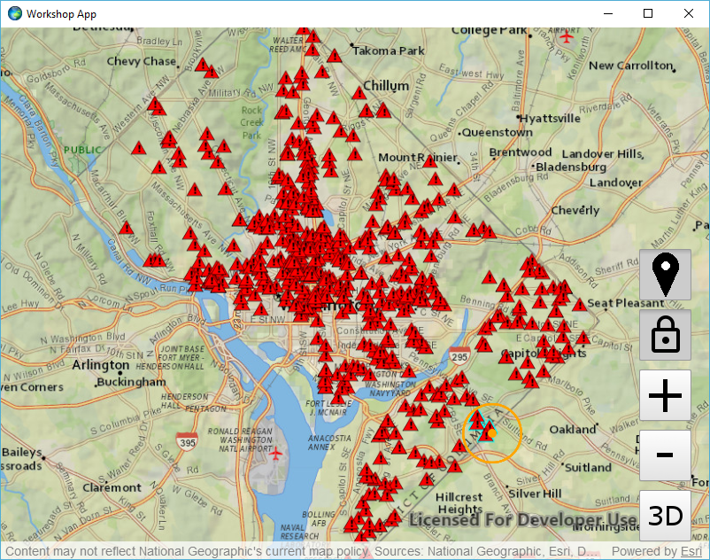

# Exercise 4: Buffer a Point and Query Features (Qt Quick)

This exercise walks you through the following:
- Get the user to click a point
- Display the clicked point and a buffer around it
- Query for features within the buffer

Prerequisites:
- Complete [Exercise 3](Exercise%203%20Local%20Feature%20Layer.md), or get the Exercise 3 code solution compiling and running properly in Qt Creator.

If you need some help, you can refer to [the solution to this exercise](../../../solutions/Qt/Qt Quick/Ex4_BufferAndQuery), available in this repository.

## Get the user to click a point

You can use ArcGIS Runtime to detect when and where the user interacts with the map or scene, either with the mouse or with a touchscreen. In this exercise, you just need the user to click or tap a point. You could detect every user click, but instead, we will let the user activate and deactivate this capability with a toggle button.

1. In your QML file, add a button to your app to enable the user to click a point on the map or scene. Make it `checkable`, i.e. make it a toggle button:

    ```
    Button {
        id: button_bufferAndQuery
        iconSource: "qrc:///Resources/location.png"
        anchors.right: mapView.right
        anchors.rightMargin: 20
        anchors.bottom: button_zoomIn.top
        anchors.bottomMargin: 10
        checkable: true
    }
    ```
    
1. Create a function called `bufferAndQuery` that handles a mouse event. Check to see if it is a left mouse button event; if so, print to the console. Later you will replace `console.log` with code that buffers the point and queries for features within that buffer:

    ```
    function bufferAndQuery(event) {
        if (Qt.LeftButton === event.button) {
            console.log("Click!");
        }
    }
    ```
    
1. In your `MapView` and your `SceneView`, add an `onMouseClicked` function to listen for a mouse click. If the buffer and query button is toggled on (i.e. `checked`), call `bufferAndQuery`. **Note: add this code to both your `MapView` and your `SceneView`**:

    ```
    onMouseClicked: function (event) {
        if (button_bufferAndQuery.checked) {
            bufferAndQuery(event);
        }
    }
    ```
    
1. Run your app. Verify that a new toggle button appears and that your `console.log` prints text when and only when the toggle button is toggled on and you click the map or the scene:

    
    
## Display the clicked point and a buffer around it

You need to buffer the clicked point and display both the point and the buffer as graphics on the map or scene.

1. In your QML code, create a marker symbol for the click and a line symbol for the buffer. In the following code, the point symbol is a 10-pixel circle with an orange (FFA500) color, and the buffer symbol is a hollow polygon with a 3-pixel orange (FFA500) solid line border:

    ```
    SimpleMarkerSymbol {
        id: clickSymbol
        style: Enums.SimpleMarkerSymbolStyleCircle
        color: "#FFA500"
        size: 10
    }
    SimpleFillSymbol {
        id: bufferSymbol
        style: Enums.SimpleFillSymbolStyleNull
        outline: SimpleLineSymbol {
            style: Enums.SimpleLineSymbolStyleSolid
            color: "#FFA500"
            width: 3
        }
    }
    ```
    
1. Create two `GraphicsOverlay` fields: one for the map and one for the scene. For the scene `GraphicsOverlay`, set its surface placement to drape on the 3D scene:

    ```
    GraphicsOverlay {
        id: bufferAndQueryMapGraphics
    }
    GraphicsOverlay {
        id: bufferAndQuerySceneGraphics
        sceneProperties: LayerSceneProperties {
            surfacePlacement: Enums.SurfacePlacementDraped
        }
    }
    ```
    
1. In your `MapView`, add the map `GraphicsOverlay` to your `MapView`:

    ```
    Component.onCompleted: {
        graphicsOverlays.append(bufferAndQueryMapGraphics)
    }
    ```
    
1. In your `SceneView`, add the scene `GraphicsOverlay` to your `SceneView`:

    ```
    Component.onCompleted: {
        graphicsOverlays.append(bufferAndQuerySceneGraphics)
    }
    ```
    
1. Create a `getGeoPoint` function to convert a mouse event to a `Point`. This method should use either the `MapView` or the `SceneView` to convert a screen point to a geographic point, depending on whether the app is currently in 2D mode or 3D mode. You're only going to call `getGeoPoint(MouseEvent)` in one place here in Exercise 4, so you don't really have to create a function just for this. But you will thank yourself for writing this function when you get to Exercise 5.

    ```
    function getGeoPoint(event) {
        var func = threeD ? sceneView.screenToBaseSurface : mapView.screenToLocation;
        return func(event.x, event.y);
    }
    ```

1. In `bufferAndQuery`, you need to replace your `console.out` with code to create a buffer and display the point and buffer as graphics. First, use `getGeoPoint` to convert the mouse event to a geographic point. Next, create a 1000-meter buffer, which is pretty simple with ArcGIS Runtime's `GeometryEngine` class:

    ```
    var geoPoint = getGeoPoint(event);
    var buffer = GeometryEngine.bufferGeodetic(
            geoPoint,
            1000,
            Enums.LinearUnitIdMeters,
            1,
            Enums.GeodeticCurveTypeGeodesic);
    ```

1. In `bufferAndQuery`, add the point and buffer as graphics. You only need to add them to the `GraphicsOverlay` for the `GeoView` currently in use--`MapView` or `SceneView`--so check the value of `threeD` and choose a `GraphicsOverlay` accordingly. Clear its graphics and then add the point and buffer as new `Graphic` objects:

    ```
    var graphics = (threeD ? bufferAndQuerySceneGraphics : bufferAndQueryMapGraphics).graphics;
    graphics.clear();
    graphics.append(ArcGISRuntimeEnvironment.createObject("Graphic", {
        geometry: buffer,
        symbol: bufferSymbol
    }));
    graphics.append(ArcGISRuntimeEnvironment.createObject("Graphic", {
        geometry: geoPoint,
        symbol: clickSymbol
    }));
    ```

1. Run your app. Verify that if you toggle the buffer and select button and then click the map or scene, the point you clicked and a 1000-meter buffer around it appear on the map or scene:

    

    
    
## Query for features within the buffer

There are a few different ways to query and/or select features in ArcGIS Runtime. Here we will use `FeatureLayer.selectFeaturesWithQuery`, which both highlights selected features on the map or scene and provides a list of the selected features.

1. Create a `QueryParameters` field:

    ```
    QueryParameters {
        id: query
    }
    ```

1. In `bufferAndQuery`, after creating the buffer and adding graphics, set the `QueryParameters`'s geometry:

    ```
    query.geometry = buffer;
    ```
    
1. For each of the `FeatureLayer` objects in the operational layers of the `SceneView`'s scene or the `MapView`'s map, call `selectFeaturesWithQuery`. Use `Enums.SelectionModeNew` to do a new selection, as opposed to adding to or removing from the current selection. _Note: ArcGIS Runtime Quartz Beta 1 highlights selected features on the map but not on the scene. It is anticipated that this behavior will be fixed in the ArcGIS Runtime Quartz release._ Add this code after instantiating the query object and setting its geometry:

    ```
    var operationalLayers = threeD ? sceneView.scene.operationalLayers : mapView.map.operationalLayers;
    operationalLayers.forEach(function (layer) {
        if (layer.selectFeaturesWithQuery) {
            layer.selectFeaturesWithQuery(query, Enums.SelectionModeNew);
        }
    });
    ```
    
1. Run your app. Verify on the 2D map that features within the clicked buffer are highlighted on the map:

    
    
## How did it go?

If you have trouble, **refer to the solution code**, which is linked near the beginning of this exercise. You can also **submit an issue** in this repo to ask a question or report a problem. If you are participating live with Esri presenters, feel free to **ask a question** of the presenters.

If you completed the exercise, congratulations! You learned how to get a user's input on the map or scene, buffer a point, display graphics on the map or scene, and select features based on a query.

Ready for more? Choose from the following:

- [**Exercise 5: Routing**](Exercise%205%20Routing.md)
- **Bonus**
    - We selected features but didn't do anything with the selected features' attributes. The call to `selectFeaturesWithQuery` is asynchronous, and `FeatureLayer` has a `selectFeaturesStatusChanged` signal that can call your code when the select is complete, so that you can iterate through selected features. See if you can look at the feature attributes to get more information about the selected features.
    - Try setting properties on the `QueryParameters` object to change the query's behavior. For example, maybe you want to select all features that are _outside_ the buffer instead of those that are inside. How would you do that by adding just one line of code? What other interesting things can you do with `QueryParameters`?