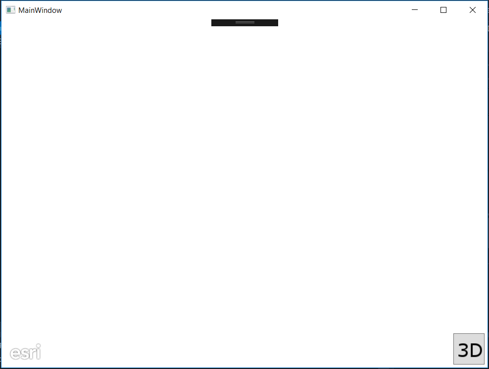
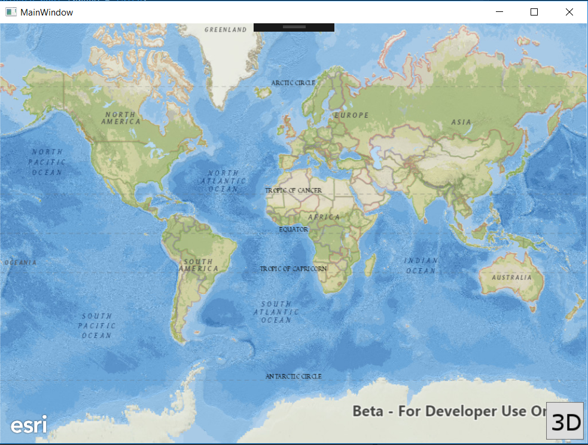
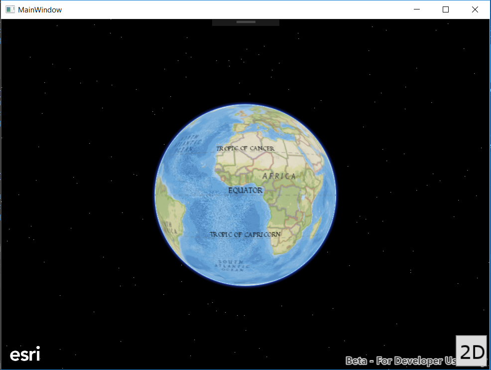

# Exercise 1: Map and Scene (.NET C#)

This exercise walks you through the following:

- Create a new Visual Studio ArcGIS Runtime Application (WPF)
- Add a 2D map to the app
- Add a 3D scene to the app, and use a button to switch between 2D and 3D

Prerequisites:

- Install Visual Studio 2015 
- [Install ArcGIS Runtime SDK for .NET (Version 100.2.1)](https://developers.arcgis.com/net/latest/)

If you need some help, you can refer to [the solution to this exercise](../../solutions/dotNETWPF/Ex1_MapAndScene), available in this repository.

## Create a new Visual Studio ArcGIS Runtime WPF application and add a 2D map
1. Using Visual Studio create a new ArcGIS Runtime Application WPF.  This will create your first map application containing a basemap.  You can compile and run the application.
    
	```
	Templates > Visual C# > Windows > Classic Desktop
    ```

2. We need to add the images that will be used by the application into the solution.  Go to [the images directory](../../images) of this repository and copy all of the images.  Then go to the Solution Explorer in Visual Studio and add a folder called 'images'.  Right click on that folder and select Add > Existing Item and add all the images to your solution.  Now let's add them as resources within our solution.  Go to the MainWindow.xaml and add the following code below Width="525> and &ltGRID>:
    
    ```
    <Window.Resources>
        <Image x:Key="3D" Source="images/three_d.png" Height="50" Width="50" />
        <Image x:Key="2D" Source="images/two_d.png" Height="50" Width="50"/>
        <Image x:Key="ZoomIn" Source="images/zoom_in.png" Stretch="Fill"/>
        <Image x:Key="ZoomOut" Source="images/zoom_out.png" Stretch="Fill"/>
	<Image x:Key="LockFocus" Source="images/lock.png" Stretch="Fill"/>
        <Image x:Key="LockFocusSelected" Source="images/lock_selected.png" Stretch="Fill"/>
        <Image x:Key="Location" Source="images/location.png" Stretch="Fill"/>
        <Image x:Key="LocationSelected" Source="images/location_selected.png" Stretch="Fill"/>
        <Image x:Key="Routing" Source="images/routing.png" Stretch="Fill"/>
        <Image x:Key="RoutingSelected" Source="images/routing_selected.png" Stretch="Fill"/>
    </Window.Resources>
    ```
3. Now we modify the MainWindow.xaml to simplify the mapView and also add the button to toggle between 2D and 3D.  This session is focused on the ArcGIS Runtime so we will not spend anytimem on UI.  Replace the code between the &ltGrid> &ltGrid/> tags with the following code:

    ```
        <esri:MapView x:Name="mapView" Margin="0,0,0.4,-0.2"/>
        <Border
            HorizontalAlignment="Right" VerticalAlignment="Bottom"
            Margin="0" Width="67" Height="175">
            <StackPanel Margin="0" Width="72" VerticalAlignment="Bottom" HorizontalAlignment="Right">
                <Button x:Name="ViewButton" Width="50" Height="50" Padding="1" Margin="0,5,5,5" HorizontalAlignment="Right" RenderTransformOrigin="4.054,-0.693" Content="{DynamicResource 3D}"/>
            </StackPanel>
        </Border>
    ```
4. Compile and run your app. Verify that a button appears in the lower-right corner of the app:

    
    
5. Add using statements for the different namespaces that will be used throughout the exercises:

    ```
   using Esri.ArcGISRuntime.Mapping;
   using Esri.ArcGISRuntime.Geometry;
   using Esri.ArcGISRuntime.Symbology;
   using Esri.ArcGISRuntime.Data;
   using Esri.ArcGISRuntime.Tasks.NetworkAnalyst;
   using Esri.ArcGISRuntime.Portal;
   using Esri.ArcGISRuntime.Security;
    ```
    
6. Set some global variables for the Map myMap and set to null:

    ```
     private Map myMap = null;
    ```
    
6. Create an Initialize() method to create the UI, setup the control references and execute initialization of the application.  Within the method we want to initialize the map and populate it with a basemap and associate the map to the map view created in the Mainwindow.xaml.  Call the initialize method after initializeComponent() in MainWindow():

    ```
    private void Initialize()
    {
        //Exercise 1: Create new Map with basemap and initial location, the basemap we will be using is a Vector Tile Basemap, there are many basemaps to choose from.
        myMap = new Map(Basemap.CreateStreetsVector());
        //Exercise 1: Assign the map to the MapView
        mapView.Map = myMap;
    }
    ```
7. Compile and run your app. Verify that a map fills the window and that a button appears in the lower-right corner of the app on top of the map:

    
    
## Add a 3D scene to the app, and use a button to switch between 2D and 3D

ArcGIS Runtime also supports 3D visualization. Everyone loves 3D! To conclude this exercise, you will add a 3D scene to the app, as well as a button that lets the user toggle between seeing the 2D map and seeing the 3D scene.

8. Before your constructor, instantiate a constant for the URL of an elevation service:

    ```
    private static string ELEVATION_IMAGE_SERVICE = 
            "http://elevation3d.arcgis.com/arcgis/rest/services/WorldElevation3D/Terrain3D/ImageServer";
    ```
    
9. Back in the MainWindow.xaml add the a SceneView for the scene to be displayed in.  Add this below the MapView.

    ```
    <esri:SceneView x:Name="sceneView" Visibility="Hidden" Margin="0,0,0.4,-0.2"/>
    ```
    
10. Before your constructor in MainWindow.xaml.cs, instantiate a variable for the Scene.  Also add a boolean for when view is in 3D, this will be used in the next exercise.

    ```
    private Scene myScene = null;
    private bool threeD = false;
    ```
    
11. In MainWindow.xaml we need to add a click event to the button to toggle to a 3D view.  Visual Studio will create the for you when start typing the Click= and you can tab to have the event handler created automatically. 

    ```
    <Button x:Name="ViewButton" Click="ViewButton_Click"  Width="50" Height="50" Padding="1" Margin="0,5,5,5" HorizontalAlignment="Right" RenderTransformOrigin="4.054,-0.693" Content="{DynamicResource 3D}"/>
    ```
    The method in MainWindow.xaml.cs looks like this:
     ```
     private void ViewButton_Click(object sender, RoutedEventArgs e)
     {
     }
     ```
12. Next let's add the code to change the image on the button and toggle the threeD variable to be true or false:
    ```
    private void ViewButton_Click(object sender, RoutedEventArgs e)
    {
	//Change button to 2D or 3D when button is clicked
        ViewButton.Content = FindResource(ViewButton.Content == FindResource("3D") ? "2D" : "3D");
	if (ViewButton.Content == FindResource("2D"))
        {
            threeD = true;
        }
        else
        {
            threeD= false;
        }
    }
    ```
    
13. If we're switching to 3D, and we have not been in 3D mode before during the current run of the app, we need to set up the 3D scene. If `scene` is null, do the following:
   1. Instantiate scene as a new Scene.
   2. Instantiate the SceneView and set its Scene.
   3. Set the Scene's basemap (Vector Tile Basemaps are currently not supported in 3D so must use a Raster Tile Basemap and elevation surface.

    ```
    if (myScene == null)
    {
       //Create a new scene
       myScene = new Scene(Basemap.CreateImageryWithLabels());
       sceneView.Scene = myScene;
       // create an elevation source
       var elevationSource = new ArcGISTiledElevationSource(new System.Uri(ELEVATION_IMAGE_SERVICE));
       // create a surface and add the elevation surface
       var sceneSurface = new Surface();
       sceneSurface.ElevationSources.Add(elevationSource);
       // apply the surface to the scene
       sceneView.Scene.BaseSurface = sceneSurface;
    }
    ```   
    
14. If we're switching to 3D, regardless of whether this is the first time (i.e. outside the `if (myScene == null)` block), hide the `MapView` and show the `SceneView` instead:

    ```
    //Once the scene has been created hide the mapView and show the sceneView
    mapView.Visibility = Visibility.Hidden;
    sceneView.Visibility = Visibility.Visible;
    ```
    
15. If we're switching to 2D, i.e. the `else` block, hide the `SceneView` and show the `MapView` instead:

    ```
    sceneView.Visibility = Visibility.Hidden;
    mapView.Visibility = Visibility.Visible;
    ```
    
16. Compile and run your app. Verify that clicking the button changes its image and also toggles between 2D and 3D:
    
    
    
## How did it go?

If you have trouble, **refer to the solution code**, which is linked near the beginning of this exercise. You can also **submit an issue** in this repo to ask a question or report a problem. If you are participating live with Esri presenters, feel free to **ask a question** of the presenters.

If you completed the exercise, congratulations! You learned how to add a 2D map and a 3D scene to an app, using ArcGIS Runtime.

Ready for more? Choose from the following:

- [**Exercise 2: Add Zoom In and Zoom Out Buttons**](Exercise 2 Zoom Buttons.md)
- **Bonus**: the map and scene we added operate independently. When you pan the map, the scene does not move, and when you pan the scene, the map does not move. Can you figure out how to link the viewpoints of the map and the scene so that when you pan one, the other automatically pans? 2D and 3D use different mechanisms for panning and zooming, so watch out! Send us a pull request if you figure it out.
