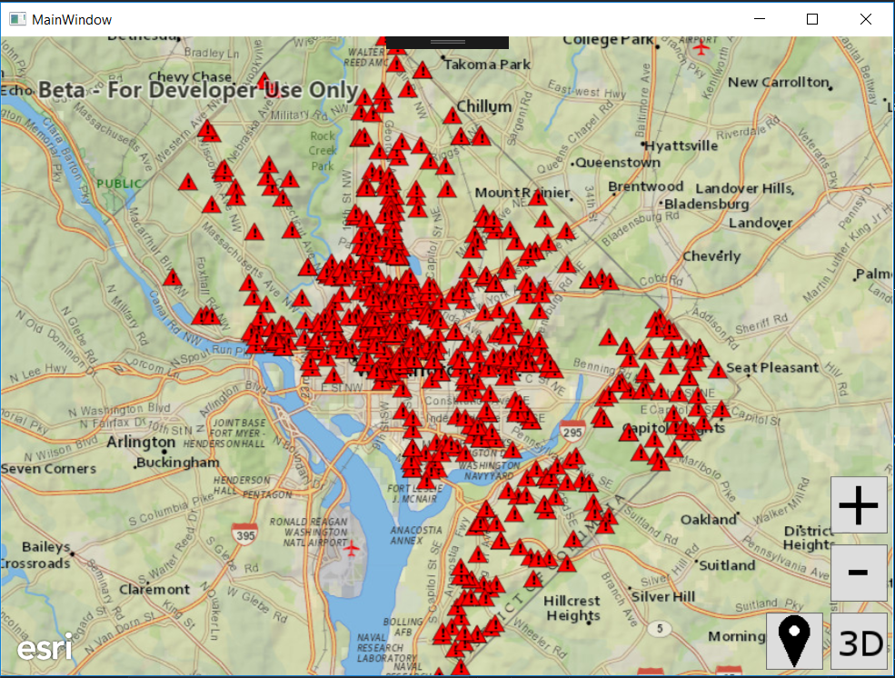
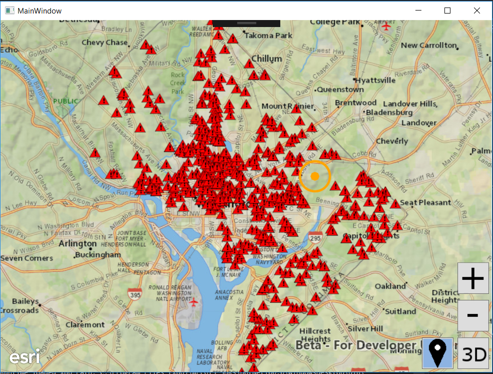
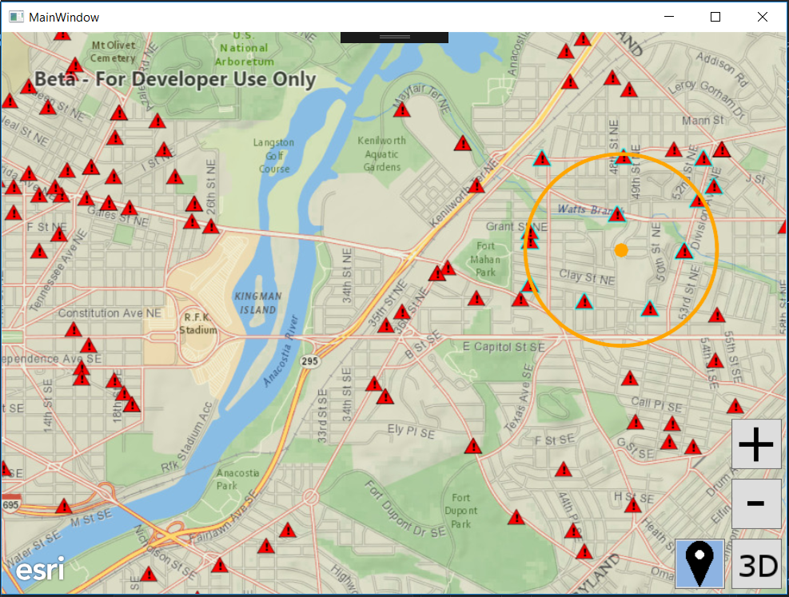

# Exercise 4: Buffer a Point and Query Features (.NET C#)

This exercise walks you through the following:
- Get the user to click a point
- Display the clicked point and a buffer around it
- Query for features within the buffer

Prerequisites:
- Complete [Exercise 3](Exercise 3 Local Feature Layer.md), or get the Exercise 3 code solution compiling and running properly, preferably in an IDE.

If you need some help, you can refer to [the solution to this exercise](../../solutions/dotNETWPF/Ex4_BufferAndQuery), available in this repository.

## Get the user to click a point

You can use ArcGIS Runtime to detect when and where the user interacts with the map or scene, either with the mouse or with a touchscreen. In this exercise, you just need the user to click or tap a point. You could detect every user click, but instead, we will let the user activate and deactivate this capability with a button.

1. We will add a new button to the UI by adding it in the MainWindow.xaml using [one of the images you downloaded](../../images/location.png) during [Exercise 1](Exercise 1 Map and Scene.md),  Add the following xaml inside your second border section in the xaml:

    ```
     <Button x:Name="QueryandBufferButton" Click="QueryandBufferButton_Click" Width="50" Height="50" Padding="1" Margin="0,5,5,5" HorizontalAlignment="Right" Content="{DynamicResource Location}" />
    ```
    
1. Add the click event in the xaml by typing Click= and use: after the x:Name="QueryAndBufferButton" and tabbing to creat the code in the MainWindow.xaml.cs.  Your MainWidnow.xaml button line will look like this:

    ```
    <Button x:Name="QueryandBufferButton" Click="QueryandBufferButton_Click" Width="50" Height="50" Padding="1" Margin="0,5" HorizontalAlignment="Left" Content="{DynamicResource Location}" />

    ```
  And your MainWindow.xaml.cs code will have a new method:
    ```
    private void QueryandBufferButton_Click(object sender, RoutedEventArgs e)
    {
    }

    ```
    
1. We will change out the button image to show that the buffer and query button has been clicked in the click event for the button:

    ```
    QueryandBufferButton.Content = FindResource(QueryandBufferButton.Content == FindResource("Location") ? "LocationSelected" : "Location");

    ```
    
1. In the same click event we want to start the listener for the tapped event for the map or scene views depending on the state of the button.  If the state is that the button is not selected anymore we want to stop listening for the tapped event.  If you remove the += OnView_Tapped and type in the += Visual studio will create the method for you and you can rename it:

    ```
    if (!threeD)
            {
                //Change Query button to Selected image
                QueryandBufferButton.Content = FindResource(QueryandBufferButton.Content == FindResource("Location") ? "LocationSelected" : "Location");
                if (QueryandBufferButton.Content == FindResource("LocationSelected"))
                {
                    mapView.GeoViewTapped += OnView_Tapped;
                }
                else
                {

                    mapView.GeoViewTapped -= OnView_Tapped;
                }
            }
    ```
    If you don't have Visual Studio create the method for you here is the code for the method:
    ```
     private void OnView_Tapped(object sender, Esri.ArcGISRuntime.UI.GeoViewInputEventArgs e)
        {
            throw new NotImplementedException();
        }
      ```
1. Add a console message to know that the map has been clicked:

    ```
    private void OnView_Tapped(object sender, Esri.ArcGISRuntime.UI.GeoViewInputEventArgs e)
        {
            Console.WriteLine("Map Tapped!");
        }
    ```
    
1. Compile and run your app. Verify that a new button appears and that your console.writeline message appears when you click the button and then click on the map or scene:

    
    
## Display the clicked point and a buffer around it

You need to buffer the clicked point and display both the point and the buffer as graphics on the map or scene.

1. Before the constructor, create global variables for the symbols for the clicked point and buffer. You can adjust the colors, styles, and widths if desired. In the following code, the point symbol is a 10-pixel circle with an orange color and no transparency, and the buffer symbol is a hollow polygon with a 3-pixel orange solid line border with no transparency.  You will also need to add the using statement for the System.Windows.Media to use the named colors:

    ```
    private SimpleMarkerSymbol CLICK_SYMBOL = new SimpleMarkerSymbol(SimpleMarkerSymbolStyle.Circle, Colors.Orange, 15);
    private SimpleFillSymbol BUFFER_SYMBOL = new SimpleFillSymbol(SimpleFillSymbolStyle.Null, Colors.Transparent, new       SimpleLineSymbol(SimpleLineSymbolStyle.Solid, Colors.Orange, 3));
    ```
    
1. Before the constructor, instantiate two `GraphicsOverlay` variables: one for the map and one for the scene:

    ```
    private GraphicsOverlay bufferAndQueryMapGraphics = new GraphicsOverlay();
    private GraphicsOverlay bufferAndQuerySceneGraphics = new GraphicsOverlay();
    ```
    
1. In your method Initialize, add the map `GraphicsOverlay` to the `MapView`:

    ```
    mapView.GraphicsOverlays.Add(bufferAndQueryMapGraphics);
    ```
    
1. Create a `private MapPoint getGeoPoint(GeoInputEventArgs)` method to convert a `GeoInputEventArgs` to a `MapPoint`. This method should use either the `MapView` to convert a screen point to a geographic point, depending on whether the app is currently in 2D mode or 3D mode. You're only going to call `getGeoPoint(GeoInputEventArgs)` in one place here in Exercise 4, so you don't really have to create a method just for this. But you will thank yourself for writing this method when you get to Exercise 5. 

    ```
    private MapPoint getGeoPoint(Esri.ArcGISRuntime.UI.Controls.GeoViewInputEventArgs point)
        {
            MapPoint geoPoint = null;
            Point screenPoint = new Point(point.Position.X, point.Position.Y);
            if (!threeD)
            {
                geoPoint = mapView.ScreenToLocation(screenPoint);
            }
            
            return geoPoint;
        }
    ```

1. In `OnView_Tapped()`, you need to replace your `console.writeline` with code to create a buffer and display the point and buffer as graphics. First, use `getGeoPoint(GeoViewInputEventArgs e)` to convert the `GeoViewInputEventArgs` to a geographic point. Next, create a 1000-meter buffer, which is pretty simple with ArcGIS Runtime's `GeometryEngine` class. _Note: ArcGIS Runtime Quartz Beta 1 cannot create geodesic buffers, so here you must project the point to a projected coordinate system (PCS), such as Web Mercator (3857), before creating the buffer. Using a PCS specific to the geographic area in question would produce a more accurate buffer. However, it is anticipated that ArcGIS Runtime Quartz will provide support for geodesic buffers, so writing code to find a better PCS will not be necessary with the Quartz release. Therefore, we did not write that code for this tutorial._

    ```
    MapPoint geoPoint = getGeoPoint(e);
    geoPoint = (MapPoint)GeometryEngine.Project(geoPoint, SpatialReference.Create(3857));
    Polygon buffer = (Polygon)GeometryEngine.Buffer(geoPoint, 1000.0);
    ```

1. In `OnView_Tapped()`, add the point and buffer as graphics. You only need to add them to the `GraphicsOverlay` for the `GeoView` currently in use--`MapView` or `SceneView`--so check the value of `threeD` and choose a `GraphicsOverlay` accordingly. Clear its graphics and then add the point and buffer as new `Graphic` objects:

    ```
    GraphicCollection graphics = bufferAndQueryMapGraphics.Graphics;
    graphics.Clear();
    graphics.Add(new Graphic(buffer, BUFFER_SYMBOL));
    graphics.Add(new Graphic(geoPoint, CLICK_SYMBOL));
    ```
1. In `QueryandBufferButton_Click`, we need to clear the graphics when he button is clicked.  So after turning off the event listener for GeoViewTapped clear graphics in both graphics layers:

    ```
    bufferAndQueryMapGraphics.Graphics.Clear();
    ```
1. Compile and run your app. Verify that if you toggle the buffer and select button and then click the map or scene, the point you clicked and a 1000-meter buffer around it appear on the map or scene:

    

    
## Query for features within the buffer

There are a few different ways to query and/or select features in ArcGIS Runtime. Here we will use `FeatureLayer.selectFeaturesAsync(QueryParameters, FeatureLayer.SelectionMode)`, which both highlights selected features on the map or scene and provides a list of the selected features.

1. In `OnView_Tapped(MouseEvent)`, after creating the buffer and adding graphics, instantiate a `QueryParameters` object with the buffer geometry:

    ```
    Esri.ArcGISRuntime.Data.QueryParameters query = new Esri.ArcGISRuntime.Data.QueryParameters();
    query.Geometry = buffer;
    ```
    
1. For each of the `FeatureLayer` objects in the operational layers of the `MapView`'s map, call `selectFeaturesAsync(QueryParameters, FeatureLayer.SelectionMode)`. Use `FeatureLayer.SelectionMode.NEW` to do a new selection, as opposed to adding to or removing from the current selection. _Note: ArcGIS Runtime Quartz Beta 1 highlights selected features on the map but not on the scene. It is anticipated that this behavior will be fixed in the ArcGIS Runtime Quartz release._ Add this code after instantiating the query object and setting its geometry:

    ```
    LayerCollection operationalLayers;
                
    operationalLayers = mapView.Map.OperationalLayers;
    foreach (Layer layer in operationalLayers)
    {
         ((FeatureLayer)layer).SelectFeaturesAsync(query, SelectionMode.New);
    }
    ```

1. Last you want to clear the selection when the query button is unselected.  Add this code in the 'QueryandBufferButton_Click' after you clear the graphics:

    ```
    LayerCollection operationalLayers;
    if (!threeD)
    {
      operationalLayers = mapView.Map.OperationalLayers;
      foreach (Layer layer in operationalLayers)
      {
        ((FeatureLayer)layer).ClearSelection();
      }
    }
    ```
    
1. Compile and run your app. Verify on the 2D map that features within the clicked buffer are highlighted on the map:

    
    
## How did it go?

If you have trouble, **refer to the solution code**, which is linked near the beginning of this exercise. You can also **submit an issue** in this repo to ask a question or report a problem. If you are participating live with Esri presenters, feel free to **ask a question** of the presenters.

If you completed the exercise, congratulations! You learned how to get a user's input on the map or scene, buffer a point, display graphics on the map or scene, and select features based on a query.

Ready for more? Choose from the following:

- [**Exercise 5: Routing**](Exercise 5 Routing.md)
- **Bonus**
    - We selected features but didn't do anything with the selected features' attributes. The call to [`selectFeaturesAsync`](https://developers.arcgis.com/net/quartz/wpf/api-reference//html/M_Esri_ArcGISRuntime_Mapping_FeatureLayer_SelectFeaturesAsync.htm) returns a .NET `Task Object` representing the asynchronous select feature operation.  The value of the task result is a `FeatureQueryResult` object, which lets you iterate through selected features. See if you can look at the feature attributes to get more information about the selected features.
    - Try setting properties on the `QueryParameters` object to change the query's behavior. For example, maybe you want to select all features that are _outside_ the buffer instead of those that are inside. How would you do that by adding just one line of code? What other interesting things can you do with `QueryParameters`?
