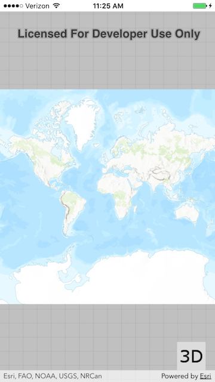
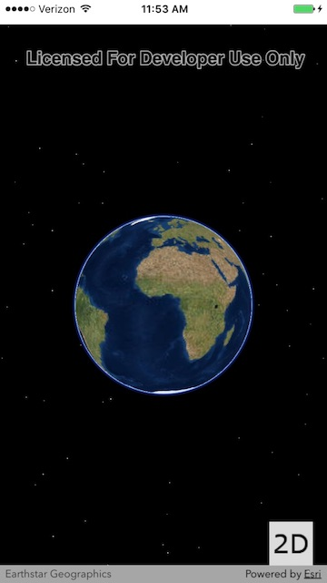

# Exercise 1: Map and Scene (iOS/Swift)

This exercise walks you through the following:
- Create a new iOS app
- Add ArcGIS Runtime to the app
- Add a 2D map to the app
- Add a 3D scene to the app, and use a toggle button to switch between 2D and 3D

Prerequisites:
- Use a Mac with macOS 10.12 or 10.13.
- (Optional) Use an iPhone, iPad, or iPod touch running iOS 10 or iOS 11. If desired, you can instead complete these exercises using the emulator that comes with Xcode.
- Install iOS SDK 11.
- Install Xcode 9.

If you need some help, you can refer to [the solution to this exercise](../../../solutions/iOS/Swift/Ex1_MapAndScene), available in this repository.

## Create a new iOS app

1. Create a new Xcode project for an iOS Single View Application. For **Language**, choose **Swift**. To make it easier to load local data in later exercises, do not use spaces in the project name.

1. In the project properties, under **Signing**, choose a **Team**. You may have to create one using your Apple ID. You must choose a team for your project if you want to run your app on a physical device. You can skip this step if you will only run your app on the simulator that comes with Xcode. 

1. At any point during the exercises, you can run the app from Xcode. If you run the app now, you should see a blank app window.

1. Download the contents of [the images directory](../../../images) of this repository. (This might be easiest if you clone this repo, or if you fork this repo and clone your fork.) Add the images to your Xcode project. This is done in Xcode by opening `Assets.xcassets` and dragging the images from the Finder into `Assets.xcassets`.

1. Open `Main.storyboard`. Use the **Object** library in the **Library** panel to add a **Button** to the lower right corner of your storyboard’s main view. Here are some tips in case you are new to Xcode and storyboards:
    - In the **Attributes** inspector, under **Button**, delete the **Title** text, set the **Image** to be `three_d`, and set the **Background** to be `gray_background`.
    - In the **Size** inspector, change the button’s width and height to 50x50. Under **Autoresizing**, pin the button to the lower-right corner (instead of the default upper-left corner).

1. Run your app. Verify that a button appears in the lower-right corner of the app, even when you rotate the device:

    
    
## Add ArcGIS Runtime to the app

1. In your project directory, create a text file named `Podfile` with the following contents, replacing `WorkshopApp` with the name of your project:

    ```
    platform :ios, '10.0'
    use_frameworks!

    target 'WorkshopApp' do
    pod 'ArcGIS-Runtime-SDK-iOS', '100.2.1'
    end
    ```

1. In a terminal, go to your project directory and run `pod install`. ArcGIS Runtime is downloaded and installed in your project’s new `Pods` directory. (Note: if this `Pods` directory is ever deleted, you can always run `pod install` to get it back. Normally you would not add `Pods` to version control.)

1. Close your Xcode project. In Xcode, open your project, but be sure from now on to choose the `xcworkspace` file, not the `xcodeproj` file. When your project opens, in the **Project** navigator, under `WorkshopApp` > `Frameworks`, delete `Pods_<app name>.framework`.

## Add a 2D map to the app

1. Open `Main.storyboard`. Use the **Object** library to add a **View** to your main view. Resize it to fill all or most of the storyboard. In the **Identity** inspector, change the custom view’s class from `UIView` to `AGSMapView`. If `AGSMapView` does not appear in the dropdown, type `AGSMapView`. In the **View Controller Scene** tree view, drag **Map View** above the button you created so that the button is added after the map view and displays on top of the map view.

1. Choose **View** > **Assistant Editor** > **Show Assistant Editor**. In the Assistant Editor, open ViewController.swift if it does not open by default. Control-drag your Map View to the `ViewController` Swift code in order to insert an outlet in the `ViewController` class. Name the outlet `mapView`. That should give you a like like this in `ViewController.swift`:

    ```
    @IBOutlet weak var mapView: AGSMapView!
    ```

1. In `ViewController.swift`, before the class declaration, import ArcGIS:

    ```
    import ArcGIS
    ```

1. In `viewDidLoad()`, give your map view a new map that contains a basemap:

    ```
    mapView.map = AGSMap(basemap: AGSBasemap.topographicVector())
    ```

1. Run your app. Verify that a map fills the screen and that the button appears on the right:

    
    
## Add a 3D scene to the app, and use a toggle button to switch between 2D and 3D

Everyone loves 3D! To conclude this exercise, you will add a 3D scene to the app, as well as a button that lets the user toggle between seeing the 2D map and seeing the 3D scene.

1. Open `Main.storyboard`. Use the **Object** library to add another **View** to your main view. Make sure it’s a child of the main view, not the map view. Resize it to fill all or most of the storyboard. Set its class to `AGSSceneView`. In the Attributes inspector, check the **Hidden** box.

1. In the Assistant Editor, open `ViewController.swift`. Control-drag to create an outlet for the scene view:

    ```
    @IBOutlet weak var sceneView: AGSSceneView!
    ```

1. Control-drag the button to create another connection, but this time, change the connection type from **Outlet** to **Action**. Give it a name, e.g. `button_toggle2d3d_onAction`. Change the parameter type from `Any` to `UIButton`. Click Connect, and a new method is created:

    ```
    @IBAction func button_toggle2d3d_onAction(_ sender: UIButton) {
    }
    ```

1. Close the Assistant Editor and open `ViewController.swift`. In your `ViewController` class, instantiate a constant for the URL of an elevation service, as well as a variable to keep track of whether the app is currently displaying 3D or not:

    ```
    let ELEVATION_IMAGE_SERVICE = "https://elevation3d.arcgis.com/arcgis/rest/services/WorldElevation3D/Terrain3D/ImageServer"

    fileprivate var threeD = false
    ```

1. In the 2D/3D toggle button action method, change the value of the `threeD` field, and change the button's image. Also toggle the visibility of the map view and scene view:

    ```
    @IBAction func button_toggle2d3d_onAction(_ sender: UIButton) {
        threeD = !threeD
        sender.setImage(UIImage(named: threeD ? "two_d" : "three_d"), for: UIControlState.normal)

        mapView.isHidden = threeD
        sceneView.isHidden = !threeD
    }
    ```

1. In `viewDidLoad()`, set up the 3D scene’s basemap and elevation. Give the scene view a scene with a basemap, and give the scene an elevation surface:

    ```
    sceneView.scene = AGSScene(basemapType: AGSBasemapType.imagery)
    let surface = AGSSurface()
    surface.elevationSources.append(AGSArcGISTiledElevationSource(url: URL(string: ELEVATION_IMAGE_SERVICE)!))
    sceneView.scene!.baseSurface = surface
    ```
    
1. Run your app. Verify that clicking the button changes its image and also toggles between 2D and 3D:
    
    
    
## How did it go?

If you have trouble, **refer to the solution code**, which is linked near the beginning of this exercise. You can also **submit an issue** in this repo to ask a question or report a problem. If you are participating live with Esri presenters, feel free to **ask a question** of the presenters.

If you completed the exercise, congratulations! You learned how to add a 2D map and a 3D scene to an app, using ArcGIS Runtime.

Ready for more? Choose from the following:

- [**Exercise 2: Add Zoom In and Zoom Out Buttons**](Exercise%202%20Zoom%20Buttons.md)
- **Bonus**: the map and scene we added operate independently. When you pan the map, the scene does not move, and when you pan the scene, the map does not move. Can you figure out how to link the viewpoints of the map and the scene so that when you pan one, the other automatically pans? 2D and 3D use different mechanisms for panning and zooming, so watch out! Send us a pull request if you figure it out.
